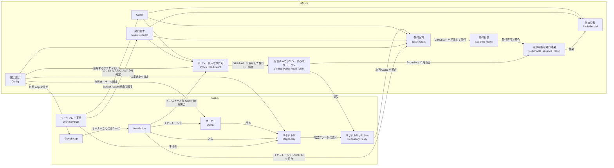
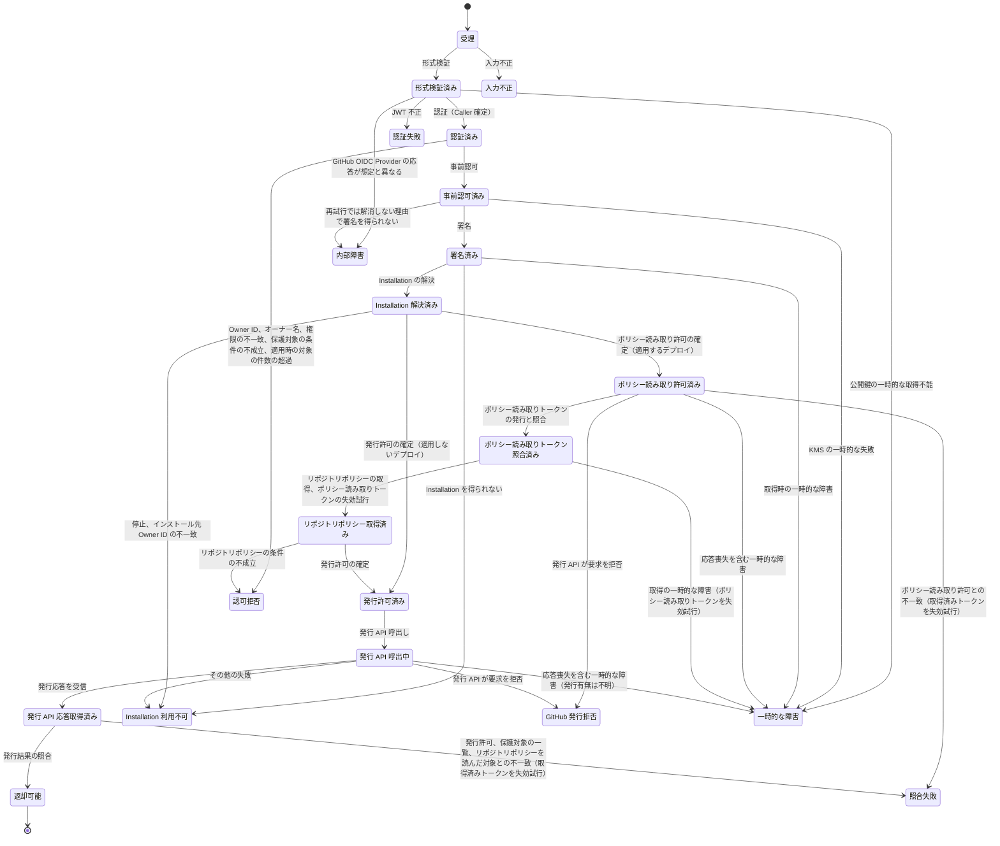
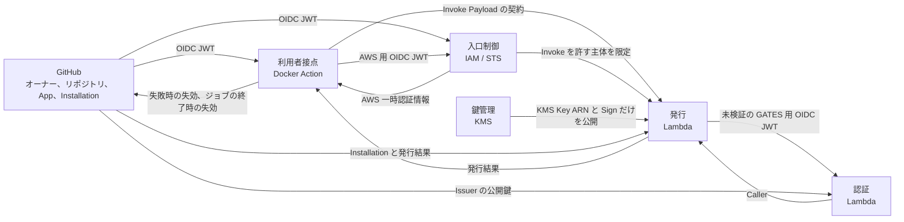

# Domain Model

GATES が扱う問題領域のドメインモデルです。
GATES は、許可された単一のオーナー配下の GitHub Actions ワークフローに、明示されたリポジトリと明示された Repository permissions の権限に限定した短命な GitHub App Installation Access Token を発行します。

## Purpose and Scope

本ドキュメントの目的は、Lambda 上の Go アプリケーション、Docker Action、Terraform の設計・実装・レビューが、概念の意味と判定のルールを一つのモデルから参照できるようにすることです。
中心に置くのは発行の判定です。
GATES 用 OIDC JWT の検証、Docker Action、AWS IAM、KMS の鍵管理は、発行の判定と語の意味が異なる範囲として境界を示すにとどめます。

モデルが答える問いは次のとおりです。

- 発行要求を誰が出し、何を要求し、何が返るか
- オーナー、リポジトリ、Installation を何で同定するか
- 発行を許可する条件は何か。拒否はどの段階で、どの種別として起きるか
- どの単位の中で、何が常に成り立たなければならないか
- 境界をまたぐと、同じ語の意味がどう変わるか

概念には英語名を併記します。
英語名は概念の名前であり、複数の単語は空白で区切ります（Token Request など）。

本ドキュメントは、GATES に必要な値を概念として定義し、GitHub や AWS がその値をどのフィールドや Claim で提供するかは書きません。
提供のされ方は手段であり、概念の意味を変えないためです。
GitHub が定めた値そのものを書くのは、ルールがその値に依存する付随権限に限ります。
GitHub が定める仕様の内容、出典、未確認事項は [GitHub Actions OIDC Constraints](../external/github/oidc.md)、[GitHub Owner and Repository Constraints](../external/github/account.md)、[GitHub App Constraints](../external/github/app.md) を正本とし、本ドキュメントはそれが GATES のルールに及ぼす影響だけを書きます。

本ドキュメントの記述は、根拠の種類を次の表記で区別します。

- **事実**：情報源に根拠がある。出典を添える
- **推論**：根拠から導いた判断
- **候補**：本ドキュメントが補った語や区分で、情報源にはない
- **未確認**：情報源で決まっていない、または情報源どうしで食い違う

## Problem Overview

GATES は、GitHub App の Private Key をワークフローに渡さずに、別のリポジトリを操作するための Installation Access Token をワークフローに渡す仲介者です。
問題領域の関係者は次のとおりです（事実：Requirements の Stakeholders and Responsibilities）。

- **ワークフロー利用者**：対象リポジトリと権限を指定してトークンを受け取る
- **GitHub App / オーナーの管理者**：GitHub App の権限と Installation の対象リポジトリを管理し、GATES で操作できる範囲の上限を決める
- **アクセスされる側のリポジトリの管理者**：リポジトリポリシーを適用するデプロイで、自分のリポジトリへの要求を許す Caller と権限を、リポジトリポリシーで決める
- **GATES 運用者**：許可オーナー、GitHub App、署名鍵、発行上限、保護対象の一覧、リポジトリポリシーの適用を固定し、GATES を運用する

GATES が所有する概念は、固定設定、発行要求、Caller、ポリシー読み取り許可、発行許可、発行結果、監査記録です。
オーナー、リポジトリ、GitHub App、Installation は GitHub が所有する概念で、GATES はそれらを参照し、照合します。
リポジトリポリシーはどちらとも位置づけが異なり、GATES が書式と意味を定め、内容はアクセスされる側のリポジトリが決め、GitHub の上に置かれます（[Repository Policies](#repository-policies)）。

GATES は、発行の判定を Invoke ごとの **発行処理**（Issuance Process）で行います。
発行処理は、一回の Invoke について、GATES が相関 ID を確かめてから成功応答か失敗応答を書くまでの処理です（事実：Lambda Design §3.2）。
監査記録、失敗の種別、[INV-014 発行処理](#inv-014-発行処理)は、どれも発行処理 1 回を単位に定めます。

## Concepts

### GitHub Entities Referenced by GATES

| 概念 | 英語名 | 同一性 | 主な性質 | 根拠 |
|---|---|---|---|---|
| **オーナー** | Owner | 不変 Owner ID | 名前（変更され得る）、種別（Organization またはユーザーアカウント）。リポジトリを所有する | 事実：GitHub Owner and Repository Constraints |
| **リポジトリ** | Repository | 不変 Repository ID | 完全名 `owner/repo`（名前変更・移管で変わり得る）、所有オーナー | 事実：GitHub Owner and Repository Constraints、GitHub Actions OIDC Constraints |
| **GitHub App** | GitHub App | Client ID | 権限の上限（GitHub 側で設定）、Private Key（複数持てる。上限は GitHub App Constraints） | 事実：GitHub App Constraints |
| **Installation** | Installation | Installation ID | インストール先 Owner ID、対象の選び方、付与された権限、停止状態 | 事実：GitHub App Constraints |
| **ワークフロー実行** | Workflow Run | ワークフロー実行 ID と試行番号 | 実行元のリポジトリとオーナー、起動のイベントと ref など。GATES 用 OIDC JWT の主体は実行元とワークフロー起動属性の一部を表し、実行そのものは識別しない | 事実：GitHub Actions OIDC Constraints |

オーナーとリポジトリは、どちらも不変 ID と名前の二つの表現を持ちます。
名前は変わり得るため、認可の同一性は不変 ID で判断し、名前は、要求の照合、発行前の保護対象の判別、発行結果の照合、許可 Caller の照合（ID の一致に重ねる条件）、GitHub API の呼び出しに使う表現と位置づけます（事実：Requirements FR-AUTHZ-001、FR-AUTHN-001、FR-AUTHZ-009、FR-AUTHZ-010、FR-ISSUANCE-004）。
名前が変わると、ID で同じものを指していても名前の照合は失敗します。
この失敗は、GATES では Fail Closed として受け入れます（事実：AWS Infrastructure Design §3.1）。

名前の表現は、次の値で扱います。

| 概念 | 英語名 | 種別 | 内容 | 根拠 |
|---|---|---|---|---|
| **完全名** | Full Name | 値 | `owner/repo` 形式のリポジトリ名。オーナー名とリポジトリ名に分割でき、比較は ASCII の範囲で大文字小文字を区別しない | 事実：Lambda Design §2.2 |
| **オーナー名** | Owner Name | 値 | 完全名のオーナー部分と許可オーナー名の二か所に現れるオーナーの名前。どちらも同じ文字種の規則に従う。比較は ASCII の範囲で大文字小文字を区別しない | 事実：Lambda Design §2.2 |
| **リポジトリ名** | Repository Name | 値 | オーナー名を含まないリポジトリの名前。完全名のリポジトリ部分、保護対象と許可 Caller の名前、Caller のリポジトリ名に現れる。完全名のリポジトリ部分、保護対象のリポジトリ名、許可 Caller のリポジトリ名は、同じ文字種の規則に従う。Caller のリポジトリ名には文字種を求めない。比較は ASCII の範囲で大文字小文字を区別しない | 事実：Lambda Design §2.2、Requirements FR-AUTHZ-009。保護対象のリポジトリ名に同じ文字種を課すのは推論：要求の名前と照合する値で、規則の外の名前は要求の側に現れないため。許可 Caller のリポジトリ名に課すのは推論：規則の外の名前の Caller を、どの許可 Caller にも当てずに拒否に倒すため。Caller のリポジトリ名に求めない理由は [INV-009 Caller](#inv-009-caller) の根拠 |

Installation には、GATES が参照する次の属性があります。

- **インストール先 Owner ID**（Installation Owner ID）：Installation がインストールされているオーナーの不変 Owner ID
- **停止状態**（Suspended）：オーナーの管理者が Installation を停止しているかどうか

Installation の対象の選び方と付与された権限は、GATES の判定に使いません。
対象の選び方は、発行結果の属性としてだけ照合します（[Issuance Result](#issuance-result)）。

Installation は、GitHub App とオーナーの組に対して高々一つ存在します（推論：GitHub App Constraints の、オーナーを指定して単一の Installation を返すエンドポイントが Organization とユーザーアカウントのそれぞれにあることから。GitHub が一意性を明示的に保証したものとは扱わない）。
この性質があるため、GATES は Installation ID を設定に持たず、固定した GitHub App と許可オーナーから実行時に導出します（事実：Requirements FR-OPS-001）。

ワークフロー実行は、**ワークフロー実行 ID**（Run ID）と **試行番号**（Run Attempt）の組で特定します。
再実行は同じワークフロー実行 ID のもとで試行番号を増やすため、両方を持って初めて一回の実行を指せます（事実：GitHub Actions OIDC Constraints）。

### Fixed Configuration

**固定設定**（Config）は、実行時の入力からは変更できない値の集まりです（事実：Requirements FR-OPS-001、FR-AUTHZ-002）。
Issuer、API Host、リポジトリポリシーのパスは GATES 自身が固定し、残りの値は GATES 運用者がデプロイ時に決めます（事実：AWS Infrastructure Design §5.1。リポジトリポリシーの適用とパスは Requirements FR-AUTHZ-011、FR-OPS-001）。
そのうち許可オーナーに関する 3 つの値を **許可オーナー**（Allowed Owner）と呼びます。

| 値 | 英語名 | 使われ方 | 根拠 |
|---|---|---|---|
| 許可オーナーの不変 Owner ID | Allowed Owner ID | Caller の認可、インストール先 Owner ID の照合、実効対象の所有オーナーの Owner ID の照合 | 事実：Requirements FR-AUTHZ-001、Security Design §3.1 |
| 許可オーナー名 | Allowed Owner Name | 要求された完全名のオーナー部分の照合、Installation の取得先の指定 | 事実：Lambda Design §5 手順 3、§6.3 |
| 許可オーナーの種別 | Allowed Owner Type | Installation の取得方法の選択（Organization かユーザーアカウントか） | 事実：Lambda Design §6.3 |
| GitHub App の Client ID | Client ID | GitHub App JWT の発行者 | 事実：Lambda Design §4 |
| 署名鍵の KMS Key ARN | KMS Key ARN | GitHub App JWT の署名 | 事実：Lambda Design §4 |
| 発行上限 | Issuable Permissions | 事前認可、ポリシー読み取り許可の確定、発行許可の確定で、要求の Permissions を照合する（[Request and Decision](#request-and-decision)） | 事実：Requirements FR-AUTHZ-008 |
| 保護対象の一覧 | Protected Repositories | 事前認可、ポリシー読み取り許可の確定、発行許可の確定で、保護対象に当たる対象への要求の Caller と Permissions を照合し、発行結果の照合で実効対象のリポジトリ名と Repository ID の対応を照合する（[Protected Repositories](#protected-repositories)） | 事実：Requirements FR-AUTHZ-009、FR-AUTHZ-010 |
| リポジトリポリシーの適用 | Repository Policy Enforcement | リポジトリポリシーによる認可を行うかを決める。適用するデプロイでは、ポリシー読み取りトークンを取得してリポジトリポリシーを読み、発行許可の確定で判定する（[Repository Policies](#repository-policies)） | 事実：Requirements FR-AUTHZ-011、FR-OPS-001 |
| リポジトリポリシーのパス | Repository Policy Path | リポジトリポリシーを読むファイルの、リポジトリの中のパス。GATES が固定し、GitHub App の Single file の権限に指定するパスと一致させる | 事実：Requirements FR-AUTHZ-011、FR-AUTHZ-002 |
| GATES 用 Audience | Audience | GATES 用 OIDC JWT の Audience の照合 | 事実：OIDC JWT Claims の GOJ-AUD |
| Issuer | Issuer | GATES 用 OIDC JWT の Issuer の照合と、署名の検証に使う公開鍵の取得元。GitHub Actions の OIDC Provider に固定 | 事実：OIDC JWT Claims の GOJ-ISS、OIDC JWT Signature の GOJ-DISCOVERY-ISSUER |
| GitHub API Host | API Host | Installation の取得、トークンの発行と失効の呼び出し先。GitHub.com の API に固定 | 事実：Requirements FR-AUTHZ-002、Scope §4、Lambda Design §6.3 |

### Request and Decision

| 概念 | 英語名 | 種別 | 内容 | 根拠 |
|---|---|---|---|---|
| **発行要求** | Token Request | 値 | 対象（重複のない完全名の列）と Permissions。利用者が明示する。対象は明示した完全名だけで、全リポジトリを対象にする手段を持たない | 事実：Requirements FR-AUTHZ-003、Lambda Design §2.1 |
| **Permission Entry** | Permission Entry | 値 | 権限名と水準の組（`contents:read` など） | 事実：Requirements FR-AUTHZ-006 |
| **Permissions** | Permissions | 値 | Permission Entry の集合。権限名ごとに水準を一つ持つ（GitHub の権限の表現が権限名をキーに持つため）。GitHub の Installation Access Token の権限の表現に対応する。権限名は、発行 API のスキーマ「App Permissions」が定めるものに限らない | 事実：Requirements FR-AUTHZ-006、GitHub App Constraints |
| **許可権限** | Allowed Permissions | 値 | GATES が発行を許可する Permission Entry の集合。GitHub が Repository permissions に分類する権限の権限名と、GitHub が要求どおりに発行する水準の組を、GATES が列挙して固定したもの。発行 API のスキーマに権限名があることを条件にしない。一つの権限名に複数の水準を含み得るため、Permissions ではない。Caller と対象によって変わらない | 事実：Requirements FR-AUTHZ-006。列挙する権限名と水準：GitHub App Constraints の「権限名と分類」 |
| **発行上限** | Issuable Permissions | 値 | 許可権限のうち、そのデプロイで発行してよい Permission Entry の集合。GATES 運用者が固定設定として決める。許可権限と同じく一つの権限名に複数の水準を含み得るため、Permissions ではない。Caller と対象によって変わらない | 事実：Requirements FR-AUTHZ-008 |
| **付随権限** | Implied Permissions | 値 | 要求にかかわらず GitHub が付与する Permission Entry。`metadata:read` だけを許容する。発行上限にも、保護対象を含む要求で Caller が当たる許可 Caller の権限の上限にも、リポジトリポリシーで Caller が当たる許可 Caller の権限の上限にも含まれなくても許容する | 事実：Requirements FR-ISSUANCE-004 が付随権限 `metadata:read` の許容を定める。許可権限の各権限名を単独で要求した発行と、複数の権限を要求した発行では、`metadata:read` のほかに加わった権限はなかった（GitHub App Constraints）。未確認：`metadata:read` が付与される条件と、ほかの権限が加わらないことの保証 |
| **Caller** | Caller | 値 | 検証済み GATES 用 OIDC JWT から確定した呼び出し元。不変 Owner ID と Repository ID で識別し、リポジトリ名を持つ。ワークフロー実行 ID と試行番号、およびワークフロー起動属性を監査のためだけに添える | 事実：Requirements FR-AUTHN-001 |
| **ワークフロー起動属性** | Workflow Trigger Attributes | 値 | ワークフロー実行の起動と、GATES 用 OIDC JWT を取得したジョブを示す属性の組。誰が起動したか（行為者の名前と ID）、どのイベントか、どの ref とコミットか、どのワークフロー定義か、どの environment か。どれも欠落し得る | 事実：GitHub Actions OIDC Constraints、OIDC JWT Claims の Claim Summary |
| **署名検証済みの Claims Set** | Signature-Verified Claims Set | 値 | 署名検証を通った GATES 用 OIDC JWT の Claims Set の JSON オブジェクト全体。Claim の分類によらずすべての Claim を含み、署名を含まない。監査記録で調査に使うだけで、Caller にもワークフロー起動属性にも含めない | 事実：Requirements FR-OPS-003 |
| **発行許可** | Token Grant | 値 | Installation ID、対象の完全名の列、発行要求の Permissions。認可が成立した結果であり、利用者に返すトークンの発行 API の呼び出しの内容を定める | 事実：Security Design §3.1 |
| **ポリシー読み取り許可** | Policy Read Grant | 値 | Installation ID、対象の完全名の列、`single_file:read` だけからなる Permissions。リポジトリポリシーを適用するデプロイで、リポジトリポリシーの条件を除く認可が成立した結果であり、ポリシー読み取りトークンの発行 API の呼び出しの内容を定める | 事実：Requirements FR-ISSUANCE-002、FR-ISSUANCE-007、Security Design §3.7。語は候補 |

許可権限と発行上限は、どちらも要求の Permissions を照合する Permission Entry の集合ですが、決める主体と変わる契機が異なるため、別の概念として扱います。
許可権限は GATES のコードが列挙して固定し、GitHub の分類と発行の振る舞いを確かめた結果でだけ変わります（事実：Security Design §3.3）。
発行上限は GATES 運用者がデプロイごとに決め、許可権限の一部に限られます（事実：Requirements FR-AUTHZ-008）。
一つの概念にまとめると、デプロイ時の設定で Organization permissions のような許可権限の外の Permission Entry を発行できる形になり、許可権限が最後の上限として働かなくなります（推論）。
付随権限は要求の照合ではなく発行結果の照合で許容するものであり、発行上限の影響を受けません（事実：Security Design §3.3）。

発行要求と Caller は、同じ Invoke Payload から取り出す別の概念です。
Payload に含まれる GATES 用 OIDC JWT は Caller を確定するための資格情報であり、発行要求の一部ではありません（事実：Lambda Design §2.1）。

Caller は、利用者の自己申告からは作れません（事実：Requirements FR-AUTHN-001、FR-AUTHZ-002）。
Caller の Owner ID は認可に使い、Repository ID は監査の識別と、保護対象の一覧とリポジトリポリシーの許可 Caller に当たるかの判定に使います（事実：Requirements FR-AUTHN-001、FR-AUTHZ-009、FR-AUTHZ-011）。
Caller のリポジトリ名は許可 Caller に当たるかの判定だけに使い、Caller の同一性には含めません（事実：Requirements FR-AUTHN-001。同一性に含めないのは推論：名前は改名で変わり、作り直したリポジトリが同じ名前を持ち得るため）。
ワークフロー実行 ID と試行番号は、監査記録から GitHub 上のワークフロー実行にたどり着けるようにするために添え、認可にも Caller の同一性にも使いません（事実：Requirements FR-AUTHN-001、Security Design §5）。
ワークフロー起動属性を添えるのは、`pull_request_target` の悪用のように、どのイベントと ref でトークンを得たかが調査に要る場面で、GitHub 側の記録を参照せずに済ませるためです（事実：Security Design §5）。
ワークフロー起動属性はベストエフォートの属性であり、欠落していても Caller は確定します。
ワークフロー起動属性の値は監査記録に書き写すだけで、GATES は解釈も検証もせず、欠落した属性は欠落のまま持ちます（推論：認可に使わないため）。
値が空文字列の属性は、欠落と同じに扱います（推論：空の値は調査の手がかりにならず、区別する要求がないため）。
値が文字列でない属性も、欠落と同じに扱います（推論：拒否すると、認可に使わない属性の形が変わっただけで発行が止まるため。代わりに、GitHub が属性の型を変えると監査記録から値が消え、変更に気付きにくくなることを受け入れる）。

ワークフロー起動属性は意味を確かめて選んだ Claim の組で、後から調査に要る Claim をすべては予測できません。
そのため、署名検証済みの Claims Set を、ワークフロー起動属性とは別に監査記録へ残します（事実：Requirements FR-OPS-003）。
署名検証済みの Claims Set は資格情報ではありません（推論：署名を含まず、GATES は署名のない Claims Set を受理しないため、Bearer として提示できない）。
GATES は署名検証済みの Claims Set を監査記録に書き写すだけで、認証、認可、ワークフロー起動属性のどの判断にも使いません（推論：未知の Claim や `repo_property_*` の意味、型、変更権限を評価していないため）。

発行許可は、Caller、発行要求、固定設定（許可オーナー、発行上限、保護対象の一覧、リポジトリポリシーの適用）、取得した Installation がそろい、[RULE-010 認可条件](#rule-010-認可条件)、[RULE-015 保護対象の認可条件](#rule-015-保護対象の認可条件)、[RULE-011 Installation の有効性](#rule-011-installation-の有効性)をすべて満たしたときにだけ作られます。
リポジトリポリシーを適用するデプロイでは、さらに、各対象のリポジトリポリシーを読み、[RULE-016 リポジトリポリシーの認可条件](#rule-016-リポジトリポリシーの認可条件)を満たすことを要します。
発行許可があって初めて GitHub API へ利用者に返すトークンの発行を要求できる、という順序がこの概念の役割です。

ポリシー読み取り許可は、発行許可と別の概念として扱います。
どちらも発行 API の呼び出しの内容を定めますが、ポリシー読み取り許可は、認可がすべて成立する前（リポジトリポリシーの条件と、発行結果の照合で確かめる条件が未判定の段階）の値で、Permissions を要求ではなく GATES が固定するためです（事実：Requirements FR-ISSUANCE-002、FR-ISSUANCE-007）。
一つの概念にまとめると、発行許可が「認可が成立した結果」であるという意味が崩れ、発行許可があることを、利用者に返すトークンを取得してよい根拠にできなくなります（推論）。

### Permission Levels

発行上限と許可 Caller の権限の上限（[Protected Repositories](#protected-repositories)）は、どちらも要求の Permission Entry を、同じ権限名の水準を比べて照合します。
GitHub App に付与した水準より低い水準の要求は要求どおりに発行されたため、照合も高い水準が低い水準を含むものとします（事実：Requirements FR-AUTHZ-008、GitHub App Constraints §4.4 の観測。GitHub はこの振る舞いを保証していない）。

- **水準の順序**（Level Order）：同じ権限名の中で `read`、`write`、`admin` の順に高い。異なる権限名の水準は比べない
- **水準の包含**（Level Inclusion）：Permission Entry の集合を上限として、上限が Permission Entry `p:l` を含むのは、`p:l` が許可権限に含まれ、かつ上限が同じ権限名 `p` の、`l` と同じかより高い水準の Permission Entry を含むときである

`write` だけを許可権限に含む権限名があれば、上限にその `write` を書いても、許可権限にない `read` の要求は許しません（推論：許可権限を最後の上限として保つため。水準を比べるだけでは、GATES が要求どおりに発行されると確かめていない水準を許し得る）。
水準の包含は要求を許すかだけを決め、発行する水準を変えません。
発行許可の Permissions は要求の Permissions のままで、上限が `contents:write` でも `contents:read` の要求には `contents:read` を発行します（事実：Requirements FR-AUTHZ-008）。
発行結果の照合は、要求した水準との一致を求めたままです（[INV-012 返却可能な発行結果](#inv-012-返却可能な発行結果)）。

### Protected Repositories

GATES 運用者は、固定設定で指定したリポジトリについて、操作できるワークフローを一部のリポジトリのものに限ることができます（事実：Requirements FR-AUTHZ-009）。
指定したリポジトリへの要求には、オーナー単位の認可条件に加えて、そのリポジトリが許す Caller と権限の条件が課されます（事実：Security Design §3.6）。

| 概念 | 英語名 | 種別 | 内容 | 根拠 |
|---|---|---|---|---|
| **保護対象** | Protected Repository | 値 | 要求できる Caller と権限を限るリポジトリ。Repository ID、リポジトリ名、許可 Caller の集合を持つ。許可 Caller の集合は空でもよい | 事実：Requirements FR-AUTHZ-009 |
| **許可 Caller** | Allowed Caller | 値 | 保護対象への要求か、リポジトリポリシーを置いたリポジトリへの要求を許す Caller のリポジトリと、その Caller に許す権限の組。Repository ID、リポジトリ名、権限の上限を持つ。保護対象の一覧とリポジトリポリシーの両方に、同じ形と同じ照合の規則で現れる | 事実：Requirements FR-AUTHZ-009、FR-AUTHZ-011 |
| **権限の上限** | Permission Limit | 値 | 許可 Caller に許す Permission Entry の上限。Permissions と同じく権限名ごとに水準を一つ持ち、要求の Permission Entry を[水準の包含](#permission-levels)で照合する | 事実：Requirements FR-AUTHZ-009 |
| **許可 Caller の集合** | Allowed Caller Set | 値 | 一つの保護対象か一つのリポジトリポリシーが持つ許可 Caller の集まり。空でもよい。集合の中で Repository ID とリポジトリ名はどちらも重複しない。Caller が許可 Caller に当たるかを判定する単位 | 事実：Requirements FR-AUTHZ-009、FR-AUTHZ-011。重複しないことは INV-016、INV-017。語は候補 |
| **保護対象の一覧** | Protected Repositories | 値 | 保護対象の集合。固定設定の値で、空でもよい | 事実：Requirements FR-AUTHZ-009、FR-OPS-001 |

保護対象の同一性は Repository ID です（事実：Requirements FR-AUTHZ-010）。
リポジトリ名を併記するのは、発行要求が対象を完全名だけで示すため、発行前には名前でしか保護対象を見分けられないからです（推論：Lambda Design §2.1 の発行要求の形から）。
名前で見分けた結果は、発行結果の照合で、実効対象の Repository ID と突き合わせます。
名前と ID の対応が一覧と GitHub で食い違えば、その発行結果は返しません（[INV-012 返却可能な発行結果](#inv-012-返却可能な発行結果)）。
こうして、保護対象を改名して新しい名前で要求しても、保護を外せません（推論：新しい名前は一覧の名前と一致せず、実効対象の ID は保護対象の ID と一致するため）。

許可 Caller の同一性も Repository ID です。
許可 Caller には、Repository ID の一致に重ねて、リポジトリ名が Caller のリポジトリ名と一致することを求めます（事実：Requirements FR-AUTHZ-009）。
名前を照合するのは、一覧を読む人が名前で許可を判断するためです。
照合しなければ、ID を書き誤った一覧は、名前の示すリポジトリとは別のリポジトリを許可したまま誰にも気付かれません（推論）。
照合すれば、ID と名前のどちらを書き誤っても、その許可 Caller はどの Caller にも当たらなくなり、拒否に倒れます。

Caller と要求の Permissions を許可 Caller の集合に当てはめた結果を、**許可 Caller の判定結果**（Allowed Caller Verdict）と呼びます（語は候補）。
判定結果は、許す、許可 Caller がない、権限の上限に含まれない、Repository ID だけが一致する、リポジトリ名だけが一致する、どちらも一致しない、のどれか一つで、許すのは最初の結果だけです（事実：Lambda Design §7 が拒否の理由として見分ける区分）。
権限の上限に含まれないのは、両方が一致する許可 Caller があり、その権限の上限に要求の Permissions が[水準の包含](#permission-levels)で含まれない場合です。
Repository ID だけが一致する許可 Caller と、リポジトリ名だけが一致する許可 Caller の両方があれば、Repository ID だけが一致する結果にします。
同一性を Repository ID で判断するため、ID が一致する許可 Caller のほうが Caller と同じリポジトリを指すからです（事実：Lambda Design §7）。

保護対象の一覧は、許可権限と発行上限のどちらとも別の概念です。
許可権限と発行上限は Caller と対象によって変わらず、固定設定のうち Caller と対象の組で条件を変えるのは保護対象の一覧だけであるためです（事実：Requirements FR-AUTHZ-006、FR-AUTHZ-008、Security Design §3.1）。
保護対象の一覧は、ほかの認可条件、Installation の対象範囲と有効性、GitHub App に付与された権限の条件で拒否される要求を許可に変えません（事実：Requirements FR-AUTHZ-009）。
許可 Caller の権限の上限は、許可権限の一部に限りますが、発行上限の一部であることは求めません（推論：求めると、発行上限を狭めただけで固定設定が不変条件を満たさなくなって初期化に失敗し、どの要求も発行できなくなる。発行上限の外の Permission Entry は [RULE-010 認可条件](#rule-010-認可条件)が拒否するため、許す範囲は広がらない）。

### Repository Policies

リポジトリポリシーを適用するデプロイでは、アクセスされる側のリポジトリが、自分への要求を許す Caller と権限を自分で決めます（事実：Requirements FR-AUTHZ-011）。
保護対象の一覧が GATES 運用者の決める一部のリポジトリの条件であるのに対し、こちらはすべての対象に、そのリポジトリの側が決める条件を課します（事実：Security Design §3.7）。

| 概念 | 英語名 | 種別 | 内容 | 根拠 |
|---|---|---|---|---|
| **リポジトリポリシー** | Repository Policy | 値 | アクセスされる側のリポジトリが、自分への要求を許す許可 Caller の集合を定めた文書。そのリポジトリの既定ブランチの、リポジトリポリシーのパスに置く。許可 Caller の集合は空でもよい | 事実：Requirements FR-AUTHZ-011 |
| **リポジトリポリシーの取得の結果** | Repository Policy Fetch Result | 値 | 対象 1 件について、リポジトリポリシーの取得が返し、発行許可の確定に渡す値。文書（読み取る前の文字列）、ファイルがない、パスにあるのがファイルでない、大きさの上限を超える、のどれか。取得できない場合と想定外の応答は、この値にならない | 事実：Lambda Design §6.2、§6.3。語は候補 |
| **リポジトリポリシーの適用** | Repository Policy Enforcement | 値 | リポジトリポリシーによる認可を行うか行わないかの二値。固定設定の値で、既定値を持たない | 事実：Requirements FR-AUTHZ-011、FR-OPS-001 |

リポジトリポリシーは、固定設定とも GitHub の実体とも位置づけが異なります。
固定設定と異なり、GATES 運用者ではなく、そのリポジトリの既定ブランチに書き込める主体（アクセスされる側のリポジトリの管理者に限らない）が内容を決め、レビューと Plan を経ずに変わります（事実：Security Design §2.3）。
GitHub の実体と異なり、GitHub はファイルを保存して返すだけで、書式と意味は GATES が定めます。
そのため、GATES は発行処理のたびに読み直し、読んだ内容を [INV-017 リポジトリポリシー](#inv-017-リポジトリポリシー)で確かめてから使い、保持しません（事実：Security Design §3.7）。

リポジトリポリシーは、それを読んだリポジトリに属し、そのリポジトリは Repository ID で同定します（推論：Requirements FR-AUTHZ-012 から）。
読む操作は名前でファイルを指定し、GitHub の応答は読んだリポジトリを Repository ID で示さないため、読んだリポジトリの Repository ID は、読むのに使った照合済みのポリシー読み取りトークンの実効対象から得ます（事実：Security Design §3.7）。

リポジトリポリシーの取得は、対象ごとに、リポジトリポリシーの取得の結果を返すか、**取得できない** まま終わります。
取得できないのは、GitHub API の一時的な障害で、ファイルがあるかどうかも分からない場合です。
発行許可の確定は、取得の結果から、その対象のリポジトリポリシーが次のどちらかを決めます（事実：Lambda Design §6.2）。

- **有効なリポジトリポリシー**：取得の結果が文書で、その文書から [INV-017 リポジトリポリシー](#inv-017-リポジトリポリシー)を満たす値を作れた
- **有効なリポジトリポリシーがない**：取得の結果が、ファイルがない、パスにあるのがファイルでない、大きさの上限を超える、のどれかであるか、文書の書式か内容が不正である。どれも [RULE-016 リポジトリポリシーの認可条件](#rule-016-リポジトリポリシーの認可条件)を満たさない

照合済みのポリシー読み取りトークンで、ファイルの有無を示さない拒否のような想定外の応答が返った場合は、どの結果にも当たらず、内部障害で終わります（[Failure Kinds](#failure-kinds)）。

有効なリポジトリポリシーがないことと取得できないことを分けるのは、失敗の種別と直す担当が異なるためです。
前者はリポジトリの側が直す認可拒否、後者は再実行で解消し得る一時的な障害です（[Failure Kinds](#failure-kinds)）。
どちらも許可とは読みません。

保護対象の一覧とリポジトリポリシーは、どちらも条件を加えるだけで、優先順位を持ちません（事実：Security Design §3.6。[RULE-016 リポジトリポリシーの認可条件](#rule-016-リポジトリポリシーの認可条件)）。
許可 Caller の形と、Caller が許可 Caller に当たる条件は両者で共有します（事実：Requirements FR-AUTHZ-011）。

リポジトリポリシーを適用するデプロイでは、1 回の要求の対象の件数に、[INV-001 発行要求](#inv-001-発行要求)の 500 件より小さい **対象の件数の上限** を置きます（事実：Lambda Design §2.2。値は 10 件）。
取得の時間とレート制限の消費が、対象の件数に比例するためです。

### Issuance Result

| 概念 | 英語名 | 種別 | 内容 | 根拠 |
|---|---|---|---|---|
| **発行結果** | Issuance Result | 値 | GitHub API が返した Installation Access Token、有効期限、実効対象の集合、実効権限、対象の選び方（ポリシー読み取りトークンの発行では、読めるファイルのパスも）。GitHub REST API のスキーマ「Installation Token」に対応する | 事実：GitHub App Constraints、REST API endpoints for GitHub Apps のスキーマ「Installation Token」 |
| **実効権限** | Effective Permissions | 値 | 発行結果に含まれる Permissions。発行許可の Permissions に付随権限を加えた範囲内で、発行許可の Permissions をすべて含むことを照合する | 事実：Requirements FR-ISSUANCE-005、FR-ISSUANCE-004 |
| **実効対象** | Effective Repository | 値 | 発行結果に含まれる各リポジトリ。Repository ID、所有オーナーの Owner ID、完全名を持つ | 事実：Lambda Design §6.3 |
| **読めるファイルのパス** | Readable File Paths | 値 | ポリシー読み取りトークンの発行結果に含まれる、トークンで読めるファイルのパスの列。照合は、要素がリポジトリポリシーのパス 1 つだけであることを求める | 事実：Lambda Design §6.3。語は候補 |
| **返却可能な発行結果** | Returnable Issuance Result | 値 | 発行許可との照合を通った発行結果。利用者に返せるのはこれだけ。トークン、有効期限、実効権限、実効対象の集合を持つ | 事実：Security Design §3.4 |
| **照合済みのポリシー読み取りトークン** | Verified Policy Read Token | 値 | ポリシー読み取り許可との照合を通った発行結果。トークンと、ポリシー読み取り許可の各対象（完全名）に対応する実効対象の Repository ID を、対象の順に持つ。実効対象の所有オーナーの Owner ID は照合で許可オーナーと一致しており、持たない。リポジトリポリシーの取得にだけ使い、利用者に返さない | 事実：Security Design §3.4、§3.7。語は候補 |

発行結果は、発行許可による発行とポリシー読み取り許可による発行のどちらにも現れます。
発行 API が同じだからです（事実：Requirements FR-ISSUANCE-007、GitHub App Constraints §4.2、§4.4）。
照合を通った値は、元の許可によって別の概念になります。
照合済みのポリシー読み取りトークンを返却可能な発行結果と一つの概念にしないのは、照合の条件（Permissions が要求か固定か、読めるファイルのパス）と、使い道（利用者に返すか、GATES の中だけで使うか）が異なるためです（推論）。

**対象の選び方**（Repository Selection）は、発行結果の対象が選択したリポジトリに限られるか、全リポジトリかの二値です。
照合の条件は [INV-012 返却可能な発行結果](#inv-012-返却可能な発行結果)と [INV-019 照合済みのポリシー読み取りトークン](#inv-019-照合済みのポリシー読み取りトークン)に置きます。

発行結果は照合の前の値であり、不変条件を持ちません。
トークン文字列以外の項目を読み取れなかった発行結果も発行結果であり、照合は、読み取れなかった項目に関わる条件を満たさないものとして扱います（事実：Lambda Design §6.3）。
こうすると、項目を読み取れたかどうかは照合の結果だけを変え、トークン文字列を取得できた発行処理が失効を試みられるかどうかを変えません。

### Credentials

GATES の処理には複数の **資格情報**（Credential）が現れ、どれも「トークン」と呼ばれ得ます（事実：System Architecture §4。ポリシー読み取りトークンは Requirements FR-ISSUANCE-007）。
語の衝突を避けるため、本ドキュメントでは次の名前で区別します。

| 資格情報 | 英語名 | 発行元 | 用途 | 発行の判定に現れるか |
|---|---|---|---|---|
| **AWS 用 OIDC JWT** | AWS OIDC JWT | GitHub OIDC Provider（Audience は AWS STS） | IAM Role の引き受け | 現れない。利用者接点が取得し、入口制御が検証する |
| **AWS 一時認証情報** | AWS Credentials | AWS STS | Lambda Invoke の署名 | 現れない |
| **GATES 用 OIDC JWT** | GATES OIDC JWT | GitHub OIDC Provider（Audience は GATES 用 Audience） | Caller の確定 | 現れる。認証の入力 |
| **GitHub App JWT** | App JWT | GATES が組み立て、KMS が署名 | GitHub API の呼び出し | 現れる。GATES の外に出さない |
| **Installation Access Token** | Installation Access Token | GitHub API | 対象リポジトリの、実効権限が許す操作 | 現れる。発行結果の中心。返却可能な発行結果はこれに有効期限・対象・実効権限を添えたもの |
| **ポリシー読み取りトークン** | Policy Read Token | GitHub API | 対象リポジトリのリポジトリポリシーの読み取り | 現れる。リポジトリポリシーを適用するデプロイで、発行許可より前に取得する。GATES の外に出さない |

ポリシー読み取りトークンは、GitHub の上では Installation Access Token の一つで、同じ発行 API で取得し（事実：Requirements FR-ISSUANCE-007）、同じ失効 API で失効させます（事実：GitHub App Constraints §4.3。`single_file:read` のトークンを失効させた観測）。
それでも別の資格情報として扱うのは、取得してよい時点、権限を決める主体、行き先が異なるためです。
利用者に返す Installation Access Token は、認可が成立した後にだけ、要求した Permissions で取得し、利用者に返します。
ポリシー読み取りトークンは、認可がすべて成立する前に、GATES が固定した `single_file:read` で取得し、GATES の中でだけ使います（事実：Requirements FR-ISSUANCE-002、FR-ISSUANCE-007）。
ポリシー読み取り許可による発行結果のトークン文字列は、照合の成否によらずポリシー読み取りトークンであり、利用者に返すトークンとしては読みません（推論：発行応答の形は同じため、読み取る時点で資格情報を分けないと、照合を通った値を利用者に返す経路に取り違え得る）。
本ドキュメントでは、利用者に返すために取得する Installation Access Token を「利用者に返すトークン」とも呼び、修飾なしの Installation Access Token もこれを指します。

GATES 用 OIDC JWT は、Payload から取り出した時点では未検証であり、認証を通って初めて Caller の根拠になります。
認証を通る前の値を **未検証の GATES 用 OIDC JWT**（Unverified GATES OIDC JWT）と呼びます。
GATES 用 OIDC JWT は OpenID Connect Core の ID Token ではありません（事実：OIDC JWT Claims の「ID Token として扱わないこと」）。
Invoke Payload の `id_token` やエラーコード `invalid_id_token` は Docker Action との契約上の名前で、概念名ではありません。
GitHub App JWT を外に出さないのは、GitHub App の権限全体を行使できる、Constitution のいう強い資格情報だからです（事実：Constitution の Design Principles 2）。

どの資格情報も、ログとエラー本文に記録しません（事実：Requirements QR-004）。
資格情報のうち利用者に返すのは Installation Access Token だけで、ポリシー読み取りトークンは返しません（事実：Requirements FR-ISSUANCE-005）。

利用者接点には、これらに加えて **要求用トークン**（OIDC Request Token）が現れます。
Runner がジョブに渡す、GitHub OIDC Provider に OIDC JWT を要求するための資格情報です（事実：GitHub Actions Design §3）。
発行の判定には現れないため上の表に含めませんが、ログに出さない点は同じです（事実：GitHub Actions Design §3.1、§3.4）。
利用者接点は、AWS 用 OIDC JWT と GATES 用 OIDC JWT を同じ手順で取得し、どちらになるかは要求した Audience で決まります。
そのため取得の手順では、両者をまとめて **OIDC JWT** と呼びます（事実：GitHub Actions Design §3）。

### Audit Record

**監査記録**（Audit Record）は、一回の発行処理の結果を、資格情報を含めずに残したものです（事実：Requirements FR-OPS-003）。

| 項目 | 記録する条件 | 根拠 |
|---|---|---|
| 相関 ID（Request ID） | 常に | 事実：Requirements FR-OPS-003 |
| 時刻、結果（成功、または失敗の種別を表すエラーコード） | 常に | 事実：Security Design §5 |
| 拒否の理由 | 失敗の種別で終わった場合。満たさなかった条件か失敗した呼び出しを示し、資格情報と Caller、要求、許可オーナー、保護対象の一覧、リポジトリポリシー、Installation の値を含めない。リポジトリポリシーの条件で拒否した場合は、要求の対象の列での位置（何番目か）と、リポジトリポリシーがない、不正（どちらも有効なリポジトリポリシーがない場合）、Caller か Permissions を許していないのどれかを示す。各区分の内訳（ファイルでない、大きすぎる、Repository ID だけが一致するなど）は Lambda Design §7 が定める。panic を回復した場合は panic の値を含めない | 事実：Security Design §5、§3.7、Lambda Design §3.2。保護対象の一覧とリポジトリポリシーの値を含めないのは推論：満たさなかった条件を示すのに要らず、文言が誤って応答に混ざっても、許可 Caller を含む内容を許可されない呼び出し元に明かさないため（Lambda Design §3.2 の許可オーナーと同じ理由） |
| Caller の Owner ID と Repository ID、ワークフロー実行 ID と試行番号 | 認証に成功した後だけ。認証前の失敗では未検証の値を Caller として記録しない | 事実：Security Design §5 |
| ワークフロー起動属性 | 認証に成功した後で、含まれていた属性だけ | 事実：Security Design §5 |
| 署名検証済みの Claims Set | 署名検証を通った後。署名検証の後の Claim の検証で認証に失敗した場合も含む | 事実：Requirements FR-OPS-003。署名検証の後の失敗を含めるのは推論：拒否した JWT の Claim が、拒否の理由を調べる手がかりになるため |
| 要求対象、要求権限 | 形式検証を通った後 | 事実：Lambda Design §1。時点は推論 |
| 取得した Installation の Installation ID とインストール先 Owner ID | Installation の解決に成功した後 | 推論：インストール先 Owner ID の不一致は運用者かオーナーの管理者が直す失敗であり、どのアカウントの Installation が返ったかを、呼び出しを再現せずに確かめるため。監査記録は応答に出ないため、エラー文言で値を伏せる理由は及ばない |
| 失効の結果 | 照合失敗で終わった場合 | 事実：Lambda Design §3.1 |
| ポリシー読み取りトークンの失効の結果 | ポリシー読み取りトークンの発行 API を呼んだ後。発行処理の結果を問わない。panic を回復した場合は、失効の結果が発行処理の結果として返らないため記録しない | 事実：Requirements FR-OPS-003、Security Design §5。発行 API を呼んだ後とするのは推論：応答を喪失した処理のように、GitHub 側にトークンが残り得るのに失効を試みなかった処理を「試みなかった」として残し、発行 API を呼ばなかった処理と見分けるため |

照合に失敗した発行処理では、失効を試みたかどうかと、試みた場合の成否を残します。
この値を **失効の結果**（Revocation Outcome）と呼び、試みなかった、試みて成功した、試みて失敗した、の 3 つのどれかをとります（語は候補）。
試みなかった場合を成否の一方に含めないのは、トークン文字列を取得できずに失効を試みなかった処理を、監査記録で失効を試みた処理と見分けるためです（推論：[INV-014 発行処理](#inv-014-発行処理)の不変条件は、トークン文字列を取得できた場合にだけ失効の試行を求めるため）。
ポリシー読み取りトークンの照合に失敗した発行処理も照合失敗で終わるため、失効の結果を記録し、その値は試みなかったになります（推論：利用者に返すトークンを発行する前に終わり、失効する対象がない。どちらのトークンの照合失敗かは拒否の理由が示す）。

ポリシー読み取りトークンの失効の結果も、同じ値をとります。
照合失敗の失効の結果と別の項目にするのは、一つの発行処理が両方を持ち得るためです（推論：ポリシー読み取りトークンの失効を試みた後に、利用者に返すトークンの照合が失敗し得る）。
ポリシー読み取りトークンは利用者に返さないため、利用者接点の失効は及ばず、GitHub 側に残り得るかを調べる手がかりはこの項目だけです（事実：Security Design §5）。
ポリシー読み取りトークンの失効を試みて失敗した理由（失効の応答のステータスか通信の失敗）は、ポリシー読み取りトークンの発行から取得までの段階が失敗で終わった場合に、拒否の理由に添えます（事実：Lambda Design §3.2）。
段階を通った場合は、その後の発行処理の結果によらず理由を残さず、失効の結果だけが残ります（推論：拒否の理由は失敗した段階の条件を示す項目で、通った段階の後始末の詳細を載せる場所ではない）。

常に記録する項目を除き、表の記録する条件は次の二つのどちらかです。
その値を確定する段階を発行処理が通ったか（ワークフロー起動属性は、そのうち含まれていた属性だけ。ポリシー読み取りトークンの失効の結果は、その発行 API を呼ぶ段階）、その値を伴う結果で終わったか（拒否の理由は失敗、失効の結果は照合失敗）です。
監査記録は確定した値だけを持ち、確定していない項目を既定の値で表しません（推論：既定の値で表すと、認証前の失敗の記録に Caller があるように読めるため）。

監査記録の単位は発行処理 1 回です。
中断した発行処理では残らない場合があり、残っても結果が利用者の受け取った結果と一致しない場合があります（[Lifecycle of an Issuance](#lifecycle-of-an-issuance)）。
相関 ID は成功応答と失敗応答の両方に含め、ワークフローのログから監査記録へ、監査記録からワークフロー実行 ID でワークフロー実行へ、双方向にたどれるようにします（事実：Requirements FR-ISSUANCE-005、FR-OPS-003）。

### Concept Relationships

```mermaid
flowchart LR
  subgraph GitHub
    O[オーナー<br/>Owner]
    R[リポジトリ<br/>Repository]
    APP[GitHub App]
    INS[Installation]
    WF[ワークフロー実行<br/>Workflow Run]
    RP[リポジトリポリシー<br/>Repository Policy]
  end
  subgraph GATES
    CFG[固定設定<br/>Config]
    C[Caller]
    REQ[発行要求<br/>Token Request]
    PG[ポリシー読み取り許可<br/>Policy Read Grant]
    PT[照合済みのポリシー読み取りトークン<br/>Verified Policy Read Token]
    G[発行許可<br/>Token Grant]
    RES[発行結果<br/>Issuance Result]
    IT[返却可能な発行結果<br/>Returnable Issuance Result]
    AUD[監査記録<br/>Audit Record]
  end
  O -->|所有| R
  APP -->|オーナーごとに高々一つ| INS
  INS -->|インストール先| O
  INS -->|対象| R
  WF -->|実行元| R
  R -->|既定ブランチに置く| RP
  CFG -->|許可オーナーを固定| O
  CFG -->|利用 App を固定| APP
  CFG -->|保護対象を指定| R
  WF -->|GATES 用 OIDC JWT から確定| C
  WF -->|Docker Action 経由で送る| REQ
  C --> PG
  REQ --> PG
  CFG -->|適用するデプロイだけ| PG
  INS -->|インストール先 Owner ID を照合| PG
  PG -->|GitHub API へ明示して発行し、照合| PT
  PT -->|読む| RP
  RP -->|許可 Caller を照合| G
  C --> G
  REQ --> G
  CFG --> G
  INS -->|インストール先 Owner ID を照合| G
  G -->|GitHub API へ明示して発行| RES
  RES -->|発行許可と照合| IT
  PT -->|Repository ID を照合| IT
  C --> AUD
  REQ --> AUD
  IT -->|結果| AUD
```

## Behavior

### Operations

発行処理は、次の操作をこの順に行います（事実：Lambda Design §5。リポジトリポリシーの操作は Security Design §3.7）。
「適用時」の印の操作は、リポジトリポリシーを適用するデプロイでだけ行います。

| 操作 | 英語名 | 入力 | 結果 | 根拠 |
|---|---|---|---|---|
| 形式検証 | Validate | Invoke Payload | 発行要求と未検証の GATES 用 OIDC JWT を取り出す、または入力不正 | 事実：Lambda Design §2.2 |
| 認証 | Authenticate | 未検証の GATES 用 OIDC JWT、固定設定の Issuer と Audience、Issuer の公開鍵、現在時刻 | Caller を確定する、または拒否 | 事実：Requirements FR-AUTHN-001 |
| 事前認可 | Authorize | Caller、発行要求、許可オーナー、発行上限、保護対象の一覧、リポジトリポリシーの適用 | 外部呼び出しに進める、または認可拒否。リポジトリポリシーの条件は判定しない。適用するデプロイでは、対象の件数の上限を判定する | 事実：Lambda Design §5 手順 3。保護対象の一覧は Requirements FR-AUTHZ-009。リポジトリポリシーの条件を判定しないのは Security Design §3.1。対象の件数の上限は Lambda Design §2.2 |
| 署名 | Sign | 固定設定の Client ID と KMS Key ARN、現在時刻 | GitHub App JWT、または拒否 | 事実：Requirements FR-ISSUANCE-001、Lambda Design §4 |
| Installation の解決 | Resolve Installation | GitHub App JWT、許可オーナーの名前と種別 | 取得した Installation、または拒否 | 事実：Lambda Design §3.2、§6.3 |
| ポリシー読み取り許可の確定（適用時） | Grant Policy Read | Caller、発行要求、許可オーナー、発行上限、保護対象の一覧、取得した Installation | ポリシー読み取り許可、または拒否 | 事実：Requirements FR-ISSUANCE-002、Security Design §3.7 |
| ポリシー読み取りトークンの発行（適用時） | Issue Policy Read Token | ポリシー読み取り許可、GitHub App JWT | 発行結果、または拒否 | 事実：Requirements FR-ISSUANCE-003、FR-ISSUANCE-007 |
| ポリシー読み取りトークンの照合（適用時） | Verify Policy Read Token | 発行結果、ポリシー読み取り許可、許可オーナー、保護対象の一覧、リポジトリポリシーのパス、現在時刻 | 照合済みのポリシー読み取りトークン、または照合失敗 | 事実：Requirements FR-ISSUANCE-004、Security Design §3.4 |
| リポジトリポリシーの取得（適用時） | Fetch Repository Policy | 照合済みのポリシー読み取りトークン、対象の完全名、リポジトリポリシーのパス | 対象ごとに、リポジトリポリシーの取得の結果、または取得できない | 事実：Requirements FR-AUTHZ-011、Security Design §3.7、Lambda Design §6.2 |
| ポリシー読み取りトークンの失効（適用時） | Revoke Policy Read Token | 取得できたポリシー読み取りトークン | 成功または失敗。成否は発行処理の結果を変えない | 事実：Requirements FR-ISSUANCE-007。成否が結果を変えないのは推論：失効は使い終えたトークンに対する後始末で、発行処理の判定に使う値を変えないため |
| 発行許可の確定 | Grant | Caller、発行要求、許可オーナー、発行上限、保護対象の一覧、取得した Installation、適用時は各対象のリポジトリポリシーの取得の結果 | 発行許可、または拒否 | 事実：Lambda Design §5、Security Design §3.1。保護対象の一覧は Requirements FR-AUTHZ-009。リポジトリポリシーは FR-AUTHZ-011 |
| 発行 | Issue | 発行許可、GitHub App JWT | 発行結果、または拒否 | 事実：Requirements FR-ISSUANCE-002、FR-ISSUANCE-003 |
| 発行結果の照合 | Verify | 発行結果、発行許可、許可オーナー、保護対象の一覧、適用時は照合済みのポリシー読み取りトークン、現在時刻 | 返却可能な発行結果、または照合失敗 | 事実：Requirements FR-ISSUANCE-004、FR-AUTHZ-010、FR-AUTHZ-012 |
| 失効 | Revoke | 照合を通らなかった発行結果のトークン | 成功または失敗。成否にかかわらず照合失敗のまま終わる | 事実：Requirements FR-ISSUANCE-004、Lambda Design §3.1 |
| 監査記録の出力 | Audit | 発行処理の結果 | 監査記録 | 事実：Requirements FR-OPS-003 |

ポリシー読み取りトークンの失効は、リポジトリポリシーの取得の直後に、取得の成否にかかわらず試みます。
ポリシー読み取りトークンの照合に失敗した場合は、取得を行わずに試みます。
発行許可の確定の前に試みるのは、GitHub 側にポリシー読み取りトークンが残る時間を短くするためで、順序は安全性を変えません（推論：取得の後は、ポリシー読み取りトークンを使う操作がない）。

各操作の拒否がどの失敗の種別に当たるかは、[Lifecycle of an Issuance](#lifecycle-of-an-issuance) の状態図に示します。

発行処理の外でも、次の操作が発行の結果か発行できる範囲を変えます。
認可の境界は GATES の設定（許可オーナー、発行上限、保護対象の一覧、リポジトリポリシーの適用）だけでは決まらず、Installation の対象、GitHub App に付与された権限、リポジトリポリシーに依存するため、これらの操作もモデルに含めます。

| 操作 | 主体 | 結果 | 根拠 |
|---|---|---|---|
| トークンを要求する | ワークフロー利用者 | 利用者接点が対象、権限、接続情報から発行処理を起動する | 事実：Requirements FR-OPS-006 |
| ジョブの終了時の失効、失敗時の失効 | 利用者接点 | 取り出した Installation Access Token の失効を試みる（[Contexts](#contexts)） | 事実：Requirements FR-ISSUANCE-006 |
| 発行上限を変える | GATES 運用者 | 設定の更新が完了した後の発行要求から、新しい発行上限で認可する。発行済みのトークンは失効させず、発行したときの権限のまま有効期限まで残る | 事実：Security Design §3.3 |
| 保護対象の一覧を変える | GATES 運用者 | 設定の更新が完了した後の発行要求から、新しい一覧で認可し、照合する。発行済みのトークンは失効させず、発行したときの対象と権限のまま有効期限まで残る | 事実：Security Design §3.3、§3.6 |
| リポジトリポリシーの適用を切り替える | GATES 運用者 | 設定の更新が完了した後の発行要求から、リポジトリポリシーを読むかが変わる。適用に切り替えると、リポジトリポリシーのない対象への要求は拒否される。発行済みのトークンは失効させない | 事実：Security Design §3.7（適用に切り替えた時点で、リポジトリポリシーのない対象への発行が止まる）。更新が完了した後の要求から効くことと、発行済みのトークンを失効させないことは推論：発行上限と保護対象の一覧の変更（Security Design §3.3、§3.6）と同じく、固定設定の変更であるため |
| リポジトリポリシーを変える | アクセスされる側のリポジトリの既定ブランチに書き込める主体 | 変更の後にリポジトリポリシーを読んだ発行処理から、新しい内容で認可する。変更の前にリポジトリポリシーを読み終えた発行処理と、発行済みのトークンには及ばない。リポジトリポリシーで書き込みの権限を許された Caller も、発行されたトークンでこの操作を行える | 事実：Security Design §3.7 |
| 署名鍵を更新する | GATES 運用者 | 新しい Private Key の鍵素材を持つ KMS Key を加え、署名に使う鍵を切り替える | 事実：Requirements FR-OPS-005、AWS Infrastructure Design §4.2 |
| Installation の対象を変える | GitHub App / オーナーの管理者 | 操作できる範囲の上限が変わる | 事実：Security Design §3.2 |

### Failure Kinds

発行処理がトークンを返さずに終わる失敗を、**失敗の種別**（Failure Kind）で区別します。
種別を分けるのは、区別がルール、監査記録の意味、失効の義務のいずれかを変える場合に限ります（推論：本ドキュメントが答える問いが判定のルールであるため）。
どの外部依存が失敗したかのように、直す担当も次に起きることも変えない区別は、応答のエラーコードに任せます。

| 種別 | 英語名 | 起きる条件 | 直す担当と次に起きること | 根拠 |
|---|---|---|---|---|
| **入力不正** | Invalid Request | Payload を GATES が読み取れない | 利用者が要求の形を直す。要求を読み取れていないため、監査記録に要求対象と要求権限を残さない | 事実：Lambda Design §2.2 |
| **認証失敗** | Authentication Failure | GATES 用 OIDC JWT から Caller を確定できない | 利用者がワークフローの設定を直す。OIDC JWT の主体のカスタマイズが原因なら、リポジトリかオーナーの管理者が直す（[Events Outside GATES That Change the Outcome](#events-outside-gates-that-change-the-outcome)）。Issuer の公開鍵のローテーションの直後なら、時間をおいた再実行で解消し得る（同節）。監査記録に未検証の値を Caller として残さない | 事実：Requirements FR-AUTHN-001、Security Design §5 |
| **認可拒否** | Authorization Denied | Caller と要求は読み取れたが、GATES の認可条件を満たさない。保護対象に当たる対象を含む要求で、Caller が許可 Caller に当たらないか、Permissions が許可 Caller の権限の上限に水準の包含で含まれない場合を含む。リポジトリポリシーを適用するデプロイで、有効なリポジトリポリシーがない対象か、リポジトリポリシーが Caller か Permissions を許していない対象を含む場合と、対象の件数が上限を超える場合も含む | 利用者が要求の対象か権限を直す。保護対象の一覧が GitHub の現在の状態と食い違っている場合（許可 Caller のリポジトリの改名など）は、GATES 運用者が一覧を直す。リポジトリポリシーがない、不正、または Caller か Permissions を許していない場合は、アクセスされる側のリポジトリの管理者がリポジトリポリシーを直す。監査記録には、GATES の認可で拒否したことと、満たさなかった条件が残る | 事実：Security Design §3.1、§3.6、§3.7。対象の件数の上限は Lambda Design §2.2 |
| **Installation 利用不可** | Installation Unavailable | 固定した GitHub App と許可オーナーから、発行に使える Installation を得られない。GitHub が Installation を返さない、応答から Installation を作れない、停止している、インストール先 Owner ID が一致しない、発行の間に Installation か App の状態が変わった場合 | GATES 運用者かオーナーの管理者が、GitHub 側か固定設定を直す。再試行では解消しない | 事実：Lambda Design §3.2 |
| **GitHub 発行拒否** | GitHub Issuance Rejected | GATES の認可が成立したが、GitHub 発行 API が `422` で要求を拒否した。原因は応答コードから確定できない。リポジトリポリシーを適用するデプロイで、ポリシー読み取りトークンの発行 API が `422` で拒否した場合（対象が Installation に含まれない、GitHub App に Single file の権限が付与されていないか承認されていないなど）を含む | 利用者の許可外要求とは断定せず、運用者が GitHub の発行条件・状態・応答を調べる。ポリシー読み取りトークンの拒否なら、GitHub App / オーナーの管理者が Installation の対象か GitHub App の権限を直す。トークン文字列は未取得 | 事実：Lambda Design §3.2。ポリシー読み取りトークンは Security Design §3.7、承認の前の `422` は GitHub App Constraints §4.4 の観測 |
| **照合失敗** | Verification Failure | GitHub 発行 API の応答を取得したが、発行結果が発行許可かポリシー読み取り許可と一致しないか、実効対象のリポジトリ名と Repository ID の対応が保護対象の一覧と食い違う。ポリシー読み取りトークンの読めるファイルのパスが、リポジトリポリシーのパスだけでない場合と、利用者に返すトークンの実効対象の Repository ID が、リポジトリポリシーを読んだ対象と一致しない場合を含む。発行結果に読み取れなかった項目がある場合を含む | 運用者が設定か GitHub 側の仕様変更を調べる。保護対象の一覧との食い違いなら、GATES 運用者が一覧を GitHub の現在の状態に合わせて直す。ポリシー読み取りトークンのパスの食い違いなら、GitHub App / オーナーの管理者が Single file のパスを直す。リポジトリポリシーを読んだ対象との不一致は、対象が作り直された直後なら再実行で解消し得るが、監視の対象とし、繰り返し起きるなら名前の競合を疑う。トークン文字列を取得できた場合は失効を試みる | 事実：Requirements FR-ISSUANCE-004、FR-AUTHZ-012、Lambda Design §3.1、Security Design §3.4。リポジトリポリシーを読んだ対象との不一致が再実行で解消し得るのは推論：再実行すると、作り直した後のリポジトリのリポジトリポリシーを読み直すため |
| **一時的な障害** | Transient Failure | Issuer の公開鍵の取得、KMS の署名、GitHub API の呼び出し（リポジトリポリシーの取得を含む）のいずれかが一時的に失敗した。通信の失敗、タイムアウト、サーバー側のエラー、レート制限を指す | 利用者の再実行で解消し得る。GATES も Docker Action も要求を自動で送り直さない（[Contexts](#contexts)） | 事実：Lambda Design §3.2、§6.4、GitHub Actions Design §3.3。リポジトリポリシーの取得は Security Design §3.7 |
| **内部障害** | Internal Failure | 想定外の失敗。どの段階にも属さない失敗と、再試行では解消しない外部依存の異常を含む。後者は、GitHub OIDC Provider の応答が想定と異なる場合（公開する Issuer が固定した Issuer と異なる、公開鍵集合に秘密鍵の値が含まれるなど）と、再試行では解消しない理由で KMS から署名を得られない場合（鍵の無効化、権限の不足、署名として解釈できない応答など）と、照合済みのポリシー読み取りトークンでリポジトリポリシーを取得したのに、ファイルの有無を示さない拒否（権限の拒否など）が返る場合である | 運用者が調べる。再試行では解消しない | 事実：Lambda Design §3.2。リポジトリポリシーの取得の拒否は推論：照合を通ったトークンで固定のパスを読めないのは、GitHub の振る舞いが観測（GitHub App Constraints §4.5）と異なることを示し、利用者の要求にもリポジトリの内容にも起因しないため。GitHub App の Single file のパスの食い違いは、取得の前に [INV-019 照合済みのポリシー読み取りトークン](#inv-019-照合済みのポリシー読み取りトークン)の照合で照合失敗になるため、この拒否に当たらない（推論：Lambda Design §6.3 から） |

Installation 利用不可を認可拒否と分けるのは、利用者の要求に起因しない失敗だからです。
認可拒否に含めると、監査記録では利用者の要求が許可外だったように見えます。
一時的な障害と分けるのは、再試行では解消せず、運用者の対応を要するためです。

Installation 利用不可と照合失敗は、どちらも設定ミスや GitHub 側の仕様変更を示し得る監視対象です。
両者の境界は、問題を検出した処理段階です。Installation の取得・確認時点の不整合は Installation 利用不可、発行応答を取得して照合した不整合は照合失敗です。
照合失敗を一時的な障害と分けるのも、発行結果の不整合が再試行で解消する障害ではなく、監視対象だからです。

一時的な障害は、失敗した依存先が Issuer、KMS、GitHub API のどれであっても一つの種別にまとめます。
どれが失敗しても、直す担当は変わらず、次に起きることも再試行で変わらないためです。
依存先の区別は調査のための情報であり、応答のエラーコードで表します。

再試行では解消しない外部依存の異常を一時的な障害と分けるのは、一時的な障害にすると利用者に無駄な再実行を促すためです。
新しい種別を設けず内部障害に含めるのは、内部障害と比べて、直す担当（運用者）も、監査記録に残るもの（失敗した段階までに確定した値）も、失効の義務（発行前のため、なし）も変わらないためです。
原因は監査記録の拒否の理由で区別します。

操作が返して発行処理を終わらせる失敗は、ちょうど一つの種別に属し、その種別は操作が定めます（推論：複数の種別に属すると、直す担当と次に起きることが一つに決まらないため）。

失敗の種別は、応答のエラーコードで表します。
種別とエラーコードは一時的な障害を除いて一対一に対応し、一時的な障害だけは失敗した依存先ごとにエラーコードを分けます。

### Lifecycle of an Issuance

一回の発行処理は、次の状態を順にたどります。
各段階で失敗すると、その失敗の種別で終わり、以降の段階には進みません（事実：Requirements QR-003、Lambda Design §5）。

```mermaid
stateDiagram-v2
  state "受理" as received
  state "形式検証済み" as validated
  state "認証済み" as authenticated
  state "事前認可済み" as preauthorized
  state "署名済み" as signed
  state "Installation 解決済み" as resolved
  state "ポリシー読み取り許可済み" as policy_granted
  state "ポリシー読み取りトークン照合済み" as policy_verified
  state "リポジトリポリシー取得済み" as policies_read
  state "発行許可済み" as granted
  state "発行 API 応答取得済み" as issue_responded
  state "発行 API 呼出中" as issue_requested
  state "返却可能" as returnable
  state "入力不正" as rej_request
  state "認証失敗" as rej_auth
  state "認可拒否" as rej_authz
  state "Installation 利用不可" as rej_installation
  state "GitHub 発行拒否" as rej_issue
  state "照合失敗" as rej_verify
  state "一時的な障害" as rej_transient
  state "内部障害" as rej_internal
  [*] --> received
  received --> validated : 形式検証
  received --> rej_request : 入力不正
  validated --> authenticated : 認証（Caller 確定）
  validated --> rej_auth : JWT 不正
  validated --> rej_transient : 公開鍵の一時的な取得不能
  validated --> rej_internal : GitHub OIDC Provider の応答が想定と異なる
  authenticated --> preauthorized : 事前認可
  authenticated --> rej_authz : Owner ID、オーナー名、権限の不一致、保護対象の条件の不成立、適用時の対象の件数の超過
  preauthorized --> signed : 署名
  preauthorized --> rej_transient : KMS の一時的な失敗
  preauthorized --> rej_internal : 再試行では解消しない理由で署名を得られない
  signed --> resolved : Installation の解決
  signed --> rej_installation : Installation を得られない
  signed --> rej_transient : 取得時の一時的な障害
  resolved --> granted : 発行許可の確定（適用しないデプロイ）
  resolved --> rej_installation : 停止、インストール先 Owner ID の不一致
  resolved --> policy_granted : ポリシー読み取り許可の確定（適用するデプロイ）
  policy_granted --> policy_verified : ポリシー読み取りトークンの発行と照合
  policy_granted --> rej_issue : 発行 API が要求を拒否
  policy_granted --> rej_transient : 応答喪失を含む一時的な障害
  policy_granted --> rej_verify : ポリシー読み取り許可との不一致（取得済みトークンを失効試行）
  policy_verified --> policies_read : リポジトリポリシーの取得、ポリシー読み取りトークンの失効試行
  policy_verified --> rej_transient : 取得の一時的な障害（ポリシー読み取りトークンを失効試行）
  policies_read --> granted : 発行許可の確定
  policies_read --> rej_authz : リポジトリポリシーの条件の不成立
  granted --> issue_requested : 発行 API 呼出し
  issue_requested --> issue_responded : 発行応答を受信
  issue_requested --> rej_issue : 発行 API が要求を拒否
  issue_requested --> rej_transient : 応答喪失を含む一時的な障害（発行有無は不明）
  issue_requested --> rej_installation : その他の失敗
  issue_responded --> returnable : 発行結果の照合
  issue_responded --> rej_verify : 発行許可、保護対象の一覧、リポジトリポリシーを読んだ対象との不一致（取得済みトークンを失効試行）
  returnable --> [*]
```

内部障害への遷移は認証と署名の段階のものだけを描き、どの段階でも起き得る想定外の失敗は描きません。
ポリシー読み取りトークンの発行の、Installation 利用不可への遷移（`422` と一時的な障害を除くその他の失敗）も、利用者に返すトークンの発行と同じため描きません。
発行許可の確定とポリシー読み取り許可の確定は、事前認可の認可条件も判定し直しますが、事前認可を通った要求では満たさないことがないため、その認可拒否は描きません。
発行許可の確定で認可拒否になるのは、リポジトリポリシーの条件だけです。

照合失敗は GitHub の発行応答を取得した後の拒否です。空でないトークン文字列を取得した場合は失効を試みます。発行 API への要求後に通信が断たれた場合は、GitHub 側で発行が成功していてもトークン文字列を取得できないことがあります。返却しないことは保証しますが、GitHub 側でトークンが残らないことは保証しません（事実：Requirements FR-ISSUANCE-004、QR-003）。

始まった発行処理は、失敗の種別で終わらずに打ち切られることもあります。
タイムアウトやメモリ不足で応答を書けない場合で、これを **中断**（Interruption）と呼びます（事実：Lambda Design §3.2。語は候補）。
中断を失敗の種別に含めないのは、種別は発行処理が判定して応答で表すものであり、中断では応答で表せないためです（推論）。
タイムアウトでは、発行処理が期限切れを失敗の種別として判定した後、応答を返す前に打ち切られることがあります（事実：[AWS Fault Injection](../research/aws/fault-injection.md)）。
中断はどの段階でも起き得るため、状態図には描きません。
中断した発行処理は利用者にトークンを返しませんが、監査記録が残らない場合があります。
残る場合もあり、その結果は発行処理が判定した結果（成功または失敗の種別）で、利用者が受け取った結果（応答のない中断）とは一致しません（推論：GATES は、成功でも失敗でも監査記録を書いてから応答を返すため）。
トークン文字列を取得した後に中断すると、失効を試みられず、GitHub 側でトークンが有効なまま残り得ます（推論：発行処理を続けられないため）。
ポリシー読み取りトークンも同じで、取得してから失効を試みるまでの間に中断すると、GitHub 側に有効なまま残り得ます。
監査記録が残らない場合は、残ったことを示す記録もありません（推論）。

初期化の失敗のように、応答を書けない Invoke には発行処理を始めないものもあります（事実：Lambda Design §3.2）。
固定設定が不変条件（[INV-004 許可オーナー](#inv-004-許可オーナー)、[INV-005 認証の固定設定](#inv-005-認証の固定設定)、[INV-006 署名の固定設定](#inv-006-署名の固定設定)、[INV-015 発行上限](#inv-015-発行上限)、[INV-016 保護対象の一覧](#inv-016-保護対象の一覧)、[INV-018 リポジトリポリシーの適用](#inv-018-リポジトリポリシーの適用)）を満たさなければ、その実行環境は受け取った Invoke に対して発行処理を始めません（推論：不変条件を満たさない値を作らない方針から）。
発行処理を始めない Invoke は、中断と異なり、監査記録を残さず、GitHub 側にトークンを残すこともありません（推論：GitHub API を呼ばないため）。

認可が事前認可と発行許可の確定の二段に分かれるのは、Installation を取得しないとインストール先 Owner ID を照合できず、Installation の取得には署名済みの GitHub App JWT が要るためです（推論：Lambda Design §5 の手順 3、手順 4、手順 7 の順序から）。
事前認可は、KMS と GitHub API を呼ぶ前に、認可の見込みがない要求を落とすための段階です（事実：Lambda Design §5）。
リポジトリポリシーを適用するデプロイでは、リポジトリポリシーの条件は発行許可の確定でだけ判定します。
条件の判定にはリポジトリポリシーが要り、その取得にはポリシー読み取りトークンが要り、その発行には Installation の確認が要るためです（事実：Security Design §3.1）。
ポリシー読み取りトークンは、発行 API を呼ぶ前に判定する認可条件がすべて成立した要求に対してだけ取得するため、事前認可で落とせる要求のために取得することはありません（事実：Requirements FR-ISSUANCE-002）。

### Events Outside GATES That Change the Outcome

発行処理の外で起きる次の出来事は、GATES の設定を変えなくても発行の結果を変えます。

| 出来事 | 影響 | 根拠 |
|---|---|---|
| オーナーの名前変更 | IAM Role の引き受けとオーナー名の照合が失敗し、設定を更新するまで発行が止まる | 事実：AWS Infrastructure Design §3.1 |
| リポジトリの名前変更 | 旧名で要求すると、GitHub が `422` で拒否し、GitHub 発行拒否になる。GitHub が新しい名前のリポジトリに読み替えて発行した場合も、実効対象の完全名が一致せず返却しない。同一の許可オーナー・Installation の対象に残り、ほかの条件も成立するなら、新しい完全名で要求できる。保護対象と許可 Caller のリポジトリの改名は、それぞれの行に示す | 事実：GitHub App Constraints §4.2 の観測（旧名への `422`。GitHub は保証していない）。読み替えた場合は推論：Security Design §3.4 の照合条件から |
| 保護対象の名前変更 | 新しい名前で要求すると、発行前は保護対象に当たらずに通り、GitHub 側でトークンが発行される。実効対象の Repository ID が保護対象の ID と一致し、リポジトリ名が一致しないため、照合失敗になり、失効を試みる。旧名で要求すると、発行前は保護対象として判定され、認可拒否か、認可が成立しても GitHub が `422` で拒否して GitHub 発行拒否になる。どちらも、運用者が一覧の名前を直すまで続く | 推論：INV-012 と RULE-015 から。旧名への `422` は事実：GitHub App Constraints §4.2 の観測（GitHub は保証していない） |
| 保護対象の削除と、同じ名前での作り直し | 作り直したリポジトリは別の Repository ID を持つ。その名前で要求すると、発行前は保護対象として判定され、Caller が許可 Caller に当たらなければ認可拒否、当たれば発行の後に、リポジトリ名が一致して Repository ID が一致しないため照合失敗になる。作り直したリポジトリに、前の保護対象の保護も許可も引き継がない | 推論：INV-012 と RULE-015 から。作り直しで ID が変わることは事実：GitHub Owner and Repository Constraints §3 の観測 |
| 許可 Caller のリポジトリの名前変更 | Repository ID は一致し、リポジトリ名が一致しないため、許可 Caller に当たらず認可拒否になる。運用者が一覧の名前を直すまで、そのリポジトリのワークフローは保護対象を要求できない | 推論：RULE-015 から。改名で ID が変わらないことは事実：GitHub Actions OIDC Constraints の GH-OIDC-REPOSITORY-ID-RENAME。改名の後の JWT が新しい名前を示すことは同 GH-OIDC-REPOSITORY-NAME-OBSERVED の観測（GitHub は保証していない） |
| 許可 Caller のリポジトリの削除と、同じ名前での作り直し | リポジトリ名は一致し、Repository ID が一致しないため、許可 Caller に当たらず認可拒否になる。作り直したリポジトリに許可を引き継がない | 推論：RULE-015 から。作り直しで ID が変わることは事実：GitHub Owner and Repository Constraints §3 の観測 |
| リポジトリポリシーの変更（リポジトリポリシーを適用するデプロイ） | [Operations](#operations) の「リポジトリポリシーを変える」のとおり | 事実：Security Design §3.7 |
| リポジトリポリシーの削除、不正な内容への変更 | リポジトリポリシーを適用するデプロイでは、その対象を含む要求は、どの Caller からも認可拒否になる | 推論：RULE-016 から |
| 対象のリポジトリの既定ブランチの変更（リポジトリポリシーを適用するデプロイ） | 新しい既定ブランチのリポジトリポリシーで認可する。新しい既定ブランチにリポジトリポリシーがなければ認可拒否になる | 推論：RULE-016 から。既定ブランチを読むことは事実：GitHub App Constraints §4.5 |
| 対象のリポジトリの名前変更（リポジトリポリシーを適用するデプロイ） | 新しい名前で要求すれば、そのリポジトリのリポジトリポリシーで認可する。リポジトリポリシーは対象の名前を含まないため、直す必要はない | 推論：RULE-016 から |
| 対象のリポジトリの削除と、同じ名前での作り直し（リポジトリポリシーを適用するデプロイ） | 作り直したリポジトリのリポジトリポリシーで認可する。前のリポジトリのリポジトリポリシーは引き継がない。発行処理がリポジトリポリシーを読んだ後に作り直されると、利用者に返すトークンの実効対象の Repository ID が読んだ対象と一致せず、照合失敗になる | 推論：INV-012 と RULE-016 から |
| 許可 Caller のリポジトリの名前変更、削除と作り直し（リポジトリポリシーの許可 Caller） | 保護対象の一覧の許可 Caller と同じく、許可 Caller に当たらず認可拒否になる。各対象のリポジトリポリシーを直すまで続く | 推論：RULE-016 から |
| GitHub App の Single file の権限とパスの変更 | Single file の権限を外すか承認を取り消すと、ポリシー読み取りトークンの発行が拒否され、GitHub 発行拒否になる（承認の前の観測では `422`）。パスをリポジトリポリシーのパスと異なるものにすると、ポリシー読み取りトークンの照合でパスが一致せず照合失敗になる。`Read and write` にすると、ポリシー読み取りトークンの発行結果の実効権限は変わらないが、GitHub App に書き込みの権限が加わり、署名能力の悪用でリポジトリポリシーを書き換えられ得る | 推論：INV-019 から。承認の前の `422` は事実：GitHub App Constraints §4.4 の観測。書き込めるかは未確認：GitHub App Constraints §4.5 |
| リポジトリの移管 | 所有オーナーと Installation の対象範囲が変わり得る。異なるオーナーへの移管後は、名前を変えて要求するだけでは [RULE-010 認可条件](#rule-010-認可条件)を満たさない | 推論：Requirements FR-AUTHZ-001・FR-AUTHZ-005 から |
| Installation の対象の追加・削除 | 操作できる範囲の上限が変わる。Organization では、制限していなければリポジトリ管理者も追加できる | 事実：Security Design §3.2 |
| GitHub App の権限の変更 | 広げても、許可権限に含まれないか、発行上限に水準の包含で含まれない権限を含む要求は、認可拒否のまま変わらない。保護対象への要求では、許可 Caller の権限の上限に水準の包含で含まれない権限も同じ。狭めると、付与されなくなった権限を含む要求は GitHub 発行拒否か照合失敗になる | 事実：Security Design §3.3、Requirements FR-AUTHZ-007 |
| GitHub App の再インストール | Installation ID が変わるが、設定変更なしに新しい Installation を導出する | 事実：Security Design §3.2 |
| Installation の停止 | 取得した Installation が停止状態のため、発行許可を作らず Installation 利用不可で閉じる。GitHub の発行 API を呼ばない | 事実：Security Design §3.1 |
| GitHub 側での旧 Private Key の失効 | 新しい KMS Key に切り替え済みなら影響しない | 事実：Acceptance Criteria AC-ISSUANCE-005 |
| OIDC JWT の主体のカスタマイズ | GATES が受け付ける主体の形式から外れると、入口制御の拒否か認証失敗で発行が止まる | 推論：OIDC JWT Claims の GOJ-SUB-FORMAT、AWS Infrastructure Design §3.1 の主体の条件から。実環境では未確認 |
| Issuer の公開鍵のローテーション | 新しい鍵で署名された JWT を受けて公開鍵を取り直せれば、新しい鍵に追従する。取り直せるまでの間は、正当な JWT でも一時的に拒否され得る | 推論：Lambda Design §6.1 の再取得の上限と検証条件から |

## Rules and Invariants

### Identity Rules

#### RULE-001 ID による同定

**内容**：オーナーの同一性は不変 Owner ID で判断し、名前の一致では代用しない

**根拠**：事実：Requirements FR-AUTHZ-001

#### RULE-002 ID の形式

**内容**：Owner ID、Repository ID、Installation ID、ワークフロー実行 ID、試行番号は、int64 に収まる正の整数である。Owner ID、Repository ID、Installation ID は互いに別の概念で、比べるのは同じ概念の ID どうしに限る

**根拠**：推論：GitHub の ID は 1 から始まる。試行番号が初回に `1` になることは未確認で、`0` を拒否するのは GATES の判断

#### RULE-003 名前の照合は補助

**内容**：完全名のオーナー部分と許可オーナー名の照合は、要求の整合性の確認であり、認可の根拠ではない。認可の根拠は Caller の Owner ID にあり、発行に使う Installation はインストール先 Owner ID で確かめる。保護対象と許可 Caller の同一性も Repository ID で判断する。保護対象のリポジトリ名は、発行前に保護対象に当たる対象を見分ける手がかりで、その判定を、発行結果の照合で実効対象の Repository ID と突き合わせる。許可 Caller のリポジトリ名は、保護対象の一覧とリポジトリポリシーのどちらでも、Repository ID の一致に重ねて求める条件で、書き誤りを拒否に倒すためのものであり、名前の一致だけで許可 Caller に当てない。リポジトリポリシーは名前で読むが、読んだリポジトリは照合済みのポリシー読み取りトークンの実効対象の Repository ID で同定し、利用者に返すトークンの実効対象と ID で突き合わせる

**根拠**：推論：Security Design §3.1 の条件 1 と Installation の確認が ID、条件 2 だけが名前であることから。保護対象と許可 Caller は事実：Requirements FR-AUTHZ-009、FR-AUTHZ-010、FR-AUTHZ-011。リポジトリポリシーを読んだリポジトリの同定は事実：Requirements FR-AUTHZ-012

#### RULE-004 ID の整合

**内容**：Caller の Owner ID と Repository ID は、GATES 用 OIDC JWT の中で主体を表す属性と個別の属性の両方に現れる。両方がそろい、互いに一致するときに限り Caller を確定する

**根拠**：事実：GitHub Actions OIDC Constraints、OIDC JWT Claims の Cross-Claim Invariants

#### RULE-005 名前の比較規則

**内容**：完全名とリポジトリ名の比較と重複判定は、ASCII の範囲で大文字小文字を区別しない。要求の重複判定、オーナー名の照合、実効対象の完全名の照合（ポリシー読み取りトークンの実効対象と、利用者に返すトークンの実効対象の完全名の対応づけを含む）、保護対象のリポジトリ名と要求のリポジトリ名の照合、許可 Caller のリポジトリ名と Caller のリポジトリ名の照合（保護対象の一覧とリポジトリポリシーの両方）、保護対象の一覧とリポジトリポリシーの重複判定で共通

**根拠**：事実：Lambda Design §2.2。リポジトリ名への適用は推論：GitHub の REST API がパスのリポジトリ名の大文字小文字を区別しないため（GitHub Owner and Repository Constraints §1）

### Rules

全件成立（Requirements FR-AUTHZ-004、FR-AUTHZ-007）、有効期限を延長しないこと（FR-ISSUANCE-002）、発行 API の呼び出しでの対象と権限の明示（FR-ISSUANCE-003）、付随権限 `metadata:read` の許容（FR-ISSUANCE-004）、Fail Closed（QR-003）、資格情報の非記録（QR-004）は、要求をそのまま発行処理の規則とします。
本節では定義し直さず、要求の ID で参照します。

#### RULE-006 認証条件

**適用対象**：認証

**成立条件**：GATES 用 OIDC JWT が、固定設定の Issuer が公開する鍵のうち一意に選べる一つで、GATES が許可した署名方式により署名され、Issuer が固定設定の Issuer と一致し、Audience が GATES 用 Audience の一つだけであり、有効期間内にあり、Caller の確定に要る属性を一意に読み取れて [RULE-004 ID の整合](#rule-004-id-の整合)を満たす。一つでも満たさなければ認証失敗。直列化、JOSE Header、Claim、公開鍵ごとの受理条件は根拠の受理条件が定める

**例外**：有効期間の開始は欠落を許す

**根拠**：事実：Requirements FR-AUTHN-001、FR-AUTHN-002、OIDC JWT Claims、OIDC JWT Signature

#### RULE-010 認可条件

**適用対象**：事前認可、ポリシー読み取り許可の確定、発行許可の確定

**成立条件**：Caller の Owner ID が許可オーナーの Owner ID と一致し、要求の各完全名のオーナー名が許可オーナー名と一致し、Permissions の Permission Entry がどれも許可権限に含まれ、発行上限に[水準の包含](#permission-levels)で含まれる。満たさなければ認可拒否。許可権限か発行上限に含まれない Permission Entry を除いたり、水準を変えたりして成立させない

**例外**：なし

**根拠**：事実：Security Design §3.1、§3.3、Requirements FR-AUTHZ-008。水準の包含は許可権限に含まれることを条件に含み、発行上限は [INV-015 発行上限](#inv-015-発行上限)により許可権限の一部だが、許可権限の判定も独立した条件として残す（推論：許可権限を、固定設定の読み込みの誤りにも水準の比較の誤りにも左右されない最後の上限として保つため）

#### RULE-015 保護対象の認可条件

**適用対象**：事前認可、ポリシー読み取り許可の確定、発行許可の確定

**成立条件**：要求の完全名のうち、リポジトリ名が保護対象のリポジトリ名と一致するものを、その保護対象に当たる対象とする。保護対象に当たる対象のすべてについて、その保護対象の許可 Caller のうち、Repository ID が Caller の Repository ID と一致し、かつリポジトリ名が Caller のリポジトリ名と一致するものがあり、要求の Permission Entry がどれもその許可 Caller の権限の上限に水準の包含で含まれる。満たさない保護対象が一つでもあれば、保護対象に当たらない対象を含めて要求全体を認可拒否とする。対象か Permission Entry を除いて成立させない。許可 Caller のない保護対象に当たる対象を含む要求は、Caller によらず条件を満たさない

**例外**：保護対象に当たる対象を含まない要求には、条件を課さない。リポジトリポリシーを適用するデプロイでも、この例外は残り、すべての対象への条件は [RULE-016 リポジトリポリシーの認可条件](#rule-016-リポジトリポリシーの認可条件)が課す

**根拠**：事実：Requirements FR-AUTHZ-009、FR-AUTHZ-010、FR-AUTHZ-004。名前の比較は [RULE-005 名前の比較規則](#rule-005-名前の比較規則)。[RULE-010 認可条件](#rule-010-認可条件)に含めず別の規則にするのは推論：RULE-010 の条件は、許可オーナー、GATES のコードが固定する許可権限、デプロイに一つの発行上限で決まり、Caller と対象の組を見ない。この規則は、GATES 運用者が保護対象ごとに Caller と権限を決め、リポジトリの改名や作り直しを契機に変わる。決める単位と変わる契機が異なるため、別に判定し、別に変えられるようにする

発行前の判定はリポジトリ名だけで保護対象を見分けるため、この規則だけでは、改名した保護対象を新しい名前で要求した場合と、保護対象の名前を持つ別のリポジトリを要求した場合を正しく扱えません。
その発行結果は、[INV-012 返却可能な発行結果](#inv-012-返却可能な発行結果)の、実効対象のリポジトリ名と Repository ID の対応の条件で返しません。
二つは組で働き、どちらか一方では保護になりません（推論）。

#### RULE-016 リポジトリポリシーの認可条件

**適用対象**：発行許可の確定。リポジトリポリシーを適用するデプロイに限る

**成立条件**：要求のすべての完全名について、その対象から読んだ値が有効なリポジトリポリシーであり、その許可 Caller のうち、Repository ID が Caller の Repository ID と一致し、かつリポジトリ名が Caller のリポジトリ名と一致するものがあり、要求の Permission Entry がどれもその許可 Caller の権限の上限に水準の包含で含まれる。有効なリポジトリポリシーがない対象、許可 Caller のないリポジトリポリシーの対象、条件を満たさない対象が一つでもあれば、ほかの対象を含めて要求全体を認可拒否とする。対象か Permission Entry を除いて成立させない。取得できない対象が一つでもあれば、条件を判定せずに一時的な障害で終わり、発行許可を作らない

**例外**：なし。保護対象かどうか、Caller が自分のリポジトリを対象にしているかを問わない

**根拠**：事実：Requirements FR-AUTHZ-011、FR-AUTHZ-004、Security Design §3.7。Caller が許可 Caller に当たる条件は [RULE-015 保護対象の認可条件](#rule-015-保護対象の認可条件)と同じで、名前の比較は [RULE-005 名前の比較規則](#rule-005-名前の比較規則)。RULE-015 に含めず別の規則にするのは推論：RULE-015 は GATES 運用者が固定設定で決め、一部の対象にだけ課す。この規則は対象のリポジトリの側が決め、発行処理のたびに読み直し、すべての対象に課す。決める主体、変わる契機、課す範囲が異なる。事前認可に含めないのは事実：Security Design §3.1（取得したリポジトリポリシーが要る）

この規則は、[RULE-010 認可条件](#rule-010-認可条件)、[RULE-015 保護対象の認可条件](#rule-015-保護対象の認可条件)、[RULE-011 Installation の有効性](#rule-011-installation-の有効性)に条件を加えるだけで、それらで拒否される要求を許可に変えません。
保護対象に当たる対象では、RULE-015 とこの規則の両方を満たす必要があり、片方が他方を上書きすることはありません（事実：Security Design §3.6）。
リポジトリポリシーは名前で読むため、この規則だけでは、読んだ後に対象が作り直された場合を扱えません。
その発行結果は、[INV-012 返却可能な発行結果](#inv-012-返却可能な発行結果)の、リポジトリポリシーを読んだ対象との Repository ID の一致の条件で返しません。

#### RULE-011 Installation の有効性

**適用対象**：ポリシー読み取り許可の確定、発行許可の確定

**成立条件**：取得した Installation のインストール先 Owner ID が許可オーナーの Owner ID と一致し、停止していない。満たさなければ Installation 利用不可

**例外**：なし

**根拠**：事実：Security Design §3.1

Installation に対象リポジトリが含まれることを、GATES は発行前に確認しません（事実：Security Design §2 の Authorization の行）。
含まれない対象は、発行 API が呼び出しを受け付けないか、発行結果の対象一覧が要求と一致しないかのどちらかで検出します（推論）。
失敗の種別は GitHub の応答で決まり、発行 API の `422` なら GitHub 発行拒否、一時的な障害を除くその他の失敗なら Installation 利用不可、発行応答が発行許可と一致しなければ照合失敗です。
種別からは、対象が Installation に含まれなかったことを断定できません。
どの場合も利用者にトークンを返しません。

#### RULE-013 入力不正と認可拒否の区別

**適用対象**：形式検証と認可

**成立条件**：値を読み取れない形は入力不正、読み取れて許可条件に合わない値は認可拒否

**例外**：なし

**根拠**：事実：Lambda Design §2.2

#### RULE-014 設定の固定

**適用対象**：固定設定

**成立条件**：実行時の入力から許可オーナー、GitHub App、Installation、KMS Key、Issuer、Issuer の公開鍵、Audience、API Host、発行上限、保護対象の一覧、リポジトリポリシーの適用、リポジトリポリシーのパスを指定できない。リポジトリポリシーを読むリポジトリは要求の対象だけで、ref は指定せず既定ブランチを読む

**例外**：なし

**根拠**：事実：Requirements FR-AUTHZ-002、FR-AUTHZ-011、FR-OPS-001

### Invariants

不変条件は、その値を作る時点で条件を検査し、条件を満たさない値を作らないことで守ります。

#### INV-001 発行要求

**時点**：形式検証を通った時点

**常に成り立つこと**：対象が 1 件以上 500 件以下で、各要素が完全名の形式を満たし、大文字小文字を区別しない重複がない。Permissions が [INV-002 Permissions](#inv-002-permissions) の条件を満たす

**根拠**：事実：Lambda Design §2.1、§2.2。500 件の上限は GitHub App Constraints

#### INV-002 Permissions

**時点**：作られた時点

**常に成り立つこと**：Permission Entry を 1 つ以上持ち、権限名と水準がどれも権限名と水準の文字種を満たす。Permission Entry が許可権限に含まれるかは含まず、事前認可が判定する

**根拠**：事実：Lambda Design §2.2

#### INV-004 許可オーナー

**時点**：固定設定を読んだ時点

**常に成り立つこと**：Owner ID が [RULE-002 ID の形式](#rule-002-id-の形式)を満たし、オーナー名がオーナー名の文字種を満たし、種別が二つの値のどちらかである

**根拠**：事実：Requirements FR-OPS-001、Lambda Design §2.2 の名前の文字種。推論：条件を満たさない値を作らない方針（[Invariants](#invariants) の冒頭）

#### INV-005 認証の固定設定

**時点**：認証の固定設定を読んだ時点

**常に成り立つこと**：Issuer が `https` のホストと、あれば空でないポートだけからなり、解析しても文字列が変わらない URL で、Audience が空でなく、AWS 用 OIDC JWT の Audience `sts.amazonaws.com` と異なり、ASCII の範囲で大文字小文字を区別せずに比べて、`https://github.com` と異なり、`https://github.com/` で始まらない

**根拠**：推論：空の Audience はすべての JWT を拒否し、空の Issuer は Issuer の値のない署名済み JWT を通す。`sts.amazonaws.com` を拒否するのは、同じジョブで取得する AWS 用 OIDC JWT で認証を通せるようにしないため。github.com の URL を拒否するのは、GitHub が GitHub 全体を指す `https://github.com` と、呼び出し元のオーナーとリポジトリの URL でも発行し（事実：GitHub Actions OIDC Constraints）、オーナーの URL は Audience を指定しない OIDC JWT にも入るため（事実：OIDC JWT Claims の GOJ-AUD）、同じ値を Audience に使うほかのサービス向けの OIDC JWT や、Audience を指定せずに取得した OIDC JWT で認証を通せるようにしないため。前方一致で拒否するのは、発行される URL が呼び出し元ごとに異なり、値を列挙できないため。大文字小文字を区別しないのは、ホスト名、オーナー名、リポジトリ名が大文字小文字を区別しないため。RFC 3986 §6.2.3 が同じ URL とする、空のポートや既定のポートを付けた形は、Audience に選ばれる表記と考えにくいため扱わない。`https` に限るのは、平文の通信を設定から有効にできる形にしないため。ポートを許すのは、試験で固定 Issuer の代わりの取得先を使うため

#### INV-006 署名の固定設定

**時点**：署名の固定設定を読んだ時点

**常に成り立つこと**：Client ID が空でなく、UTF-8 として正しい。KMS Key ARN が空でない

**根拠**：推論：UTF-8 として正しくない Client ID は GitHub App JWT の JSON にできず、空の Client ID の GitHub App JWT は GitHub に拒否され、空の KMS Key ARN では KMS が署名しない。どれも発行のたびに失敗する設定であり、作る時点で止める

#### INV-015 発行上限

**時点**：固定設定を読んだ時点

**常に成り立つこと**：Permission Entry を 1 つ以上持ち、どの Permission Entry も許可権限に含まれる

**根拠**：事実：Requirements FR-AUTHZ-008。推論：条件を満たさない値を作らない方針（[Invariants](#invariants) の冒頭）

#### INV-016 保護対象の一覧

**時点**：固定設定を読んだ時点

**常に成り立つこと**：保護対象の一覧と、各保護対象の許可 Caller の集合は、空でもよい。保護対象と許可 Caller の Repository ID は [RULE-002 ID の形式](#rule-002-id-の形式)を満たし、リポジトリ名はリポジトリ名の文字種を満たす。保護対象の間で Repository ID とリポジトリ名のどちらも重複しない。同じ保護対象の許可 Caller の間で Repository ID とリポジトリ名のどちらも重複しない。許可 Caller の権限の上限は Permission Entry を 1 つ以上持ち、権限名が重複せず、どの Permission Entry も許可権限に含まれる。権限の上限が発行上限に含まれることは求めない

**根拠**：事実：Requirements FR-OPS-001、FR-AUTHZ-009。文字種は Lambda Design §2.2。重複の判定は [RULE-005 名前の比較規則](#rule-005-名前の比較規則)。推論：文字種を一覧に課す理由は [リポジトリ名](#github-entities-referenced-by-gates)の根拠。保護対象のリポジトリ名が重複すると、発行前に一つの対象が当たる保護対象が一つに決まらない。保護対象の Repository ID の重複は、同じリポジトリに二つの名前が対応し、どちらかの名前の要求が必ず照合失敗になる書き誤りである。同じ保護対象の許可 Caller が重複すると、権限の上限が一つに決まらない。空の権限の上限は、許可 Caller を置かないことと区別できない書き誤りである。発行上限に含まれることを求めない理由は [Protected Repositories](#protected-repositories)。条件を満たさない値を作らない方針（[Invariants](#invariants) の冒頭）

#### INV-017 リポジトリポリシー

**時点**：取得した内容から作った時点

**常に成り立つこと**：作る元の文書は、大きさの上限を超えない。許可 Caller の集合は空でもよい。許可 Caller の Repository ID は [RULE-002 ID の形式](#rule-002-id-の形式)を満たし、リポジトリ名はリポジトリ名の文字種を満たす。許可 Caller の間で Repository ID とリポジトリ名のどちらも重複しない。許可 Caller の権限の上限は Permission Entry を 1 つ以上持ち、権限名が重複せず、どの Permission Entry も許可権限に含まれる。権限の上限が発行上限に含まれることは求めない。取得した内容の一部でもこれらを満たさなければ、リポジトリポリシーを作らず、その対象は有効なリポジトリポリシーがないものとして扱う

**根拠**：事実：Requirements FR-AUTHZ-011。大きさの上限は事実：Lambda Design §4.2。許可 Caller の条件を [INV-016 保護対象の一覧](#inv-016-保護対象の一覧)の許可 Caller と同じにするのは推論：Caller が許可 Caller に当たる条件を共有し（[RULE-016 リポジトリポリシーの認可条件](#rule-016-リポジトリポリシーの認可条件)）、同じ書き誤りを同じく拒否に倒すため。一部だけを満たさない場合に全体を作らないのは事実：Security Design §3.7、Requirements FR-AUTHZ-011。その理由は推論：正しい部分だけを使うと、書いた主体の意図より広い許可にも狭い許可にもなり得るため。条件を満たさない値を作らない方針（[Invariants](#invariants) の冒頭）にも従う

#### INV-018 リポジトリポリシーの適用

**時点**：固定設定を読んだ時点

**常に成り立つこと**：適用する、適用しないのどちらかに確定している。欠落した値と、どちらでもない値からは作らない

**根拠**：事実：Requirements FR-OPS-001。推論：欠落を「適用しない」と読むと設定の漏れでリポジトリポリシーのない対象への拒否が外れ、「適用する」と読むと更新しただけで発行が止まるため（Security Design §3.7）。条件を満たさない値を作らない方針（[Invariants](#invariants) の冒頭）にも従う

#### INV-009 Caller

**時点**：認証を通った時点

**常に成り立つこと**：[RULE-006 認証条件](#rule-006-認証条件)を満たした GATES 用 OIDC JWT だけから作られ、Owner ID と Repository ID が [RULE-004 ID の整合](#rule-004-id-の整合)を満たす。Owner ID、Repository ID、ワークフロー実行 ID、試行番号はどれも [RULE-002 ID の形式](#rule-002-id-の形式)を満たす。リポジトリ名は、主体を表す属性のうち Repository ID と組になった名前で、空でない。いずれかが欠落していれば Caller は確定しない。リポジトリ名にリポジトリ名の文字種は求めない

**根拠**：事実：Requirements FR-AUTHN-001、FR-AUTHZ-002、OIDC JWT Claims の GOJ-SUB-FORMAT。名前を Repository ID と組になったものに限るのは推論：同じ属性の中で ID と組になっていれば、別のリポジトリの名前を取り違えないため。文字種を求めないのは推論：照合する相手の許可 Caller のリポジトリ名が [INV-016 保護対象の一覧](#inv-016-保護対象の一覧)と [INV-017 リポジトリポリシー](#inv-017-リポジトリポリシー)で文字種を満たすため、文字種の外の名前は許可 Caller に当たらず拒否に倒れる。文字種を認証で求めると、許可 Caller と照合しない要求まで認証失敗にし得る

#### INV-010 Installation

**時点**：取得した応答から作った時点

**常に成り立つこと**：Installation ID とインストール先 Owner ID が [RULE-002 ID の形式](#rule-002-id-の形式)を満たす。停止状態が、停止しているか停止していないかのどちらかに確定しており、停止状態を読み取れない応答からは作らない。インストール先 Owner ID が許可オーナーの Owner ID と一致することと停止していないことは含まず、発行許可の確定が [RULE-011 Installation の有効性](#rule-011-installation-の有効性)として判定する

**根拠**：推論：読み取れない停止状態を停止していないと読むと、停止中の Installation で発行し得る（Fail Closed）。一致しない、または停止している Installation も GitHub 上に実在する値であり、作れない値ではなく発行に使えない値であるため

#### INV-011 発行許可

**時点**：確定した時点

**常に成り立つこと**：[RULE-010 認可条件](#rule-010-認可条件)と [RULE-015 保護対象の認可条件](#rule-015-保護対象の認可条件)をすべて満たす。リポジトリポリシーを適用するデプロイでは、[RULE-016 リポジトリポリシーの認可条件](#rule-016-リポジトリポリシーの認可条件)も満たし、そのリポジトリポリシーは、同じ発行処理の照合済みのポリシー読み取りトークンで読んだものである。対象は発行要求の対象と同じ列で、各完全名の表記と並びも発行要求のままである（GitHub API に渡すリポジトリ名と監査記録の要求対象を、利用者の要求と一致させるため）。Permissions は発行要求の Permissions に等しい（上限の水準に上げない）。その Permission Entry はどれも許可権限に含まれ、発行上限に水準の包含で含まれ、保護対象に当たる対象があれば、その許可 Caller の権限の上限にも水準の包含で含まれ、リポジトリポリシーを適用するデプロイでは、各対象のリポジトリポリシーで Caller が当たる許可 Caller の権限の上限にも水準の包含で含まれる。Installation ID は、インストール先 Owner ID が許可オーナーの Owner ID と一致し、停止していない Installation のものである

**根拠**：事実：Security Design §3.1、§3.6、§3.7、Requirements FR-AUTHZ-008、FR-AUTHZ-009、FR-AUTHZ-011

#### INV-012 返却可能な発行結果

**時点**：照合を通った時点

**常に成り立つこと**：トークンが空でなく、有効期限が将来である。実効対象の完全名の集合が発行許可の対象と一致し、件数が同じで、余分・欠落・重複がない。各実効対象の Repository ID が [RULE-002 ID の形式](#rule-002-id-の形式)を満たして互いに異なり、所有オーナーの Owner ID が許可オーナーの Owner ID と一致する。実効権限が、発行許可の Permissions に付随権限を加えた範囲内で、発行許可の Permissions をすべて含む。範囲と包含は権限名と水準の組で判定し、水準が発行許可と異なる Permission Entry は、高くても低くても条件を満たさない。対象の選び方が、選択したリポジトリに限られている。各実効対象と各保護対象について、実効対象の完全名のリポジトリ名が保護対象のリポジトリ名と一致することと、実効対象の Repository ID が保護対象の Repository ID と一致することが、両方成り立つか、両方成り立たない。リポジトリポリシーを適用するデプロイでは、各実効対象の Repository ID が、同じ発行処理の照合済みのポリシー読み取りトークンの、完全名が同じ実効対象の Repository ID と一致する

**根拠**：事実：Security Design §3.4、Requirements FR-ISSUANCE-004、FR-AUTHZ-010、FR-AUTHZ-012。リポジトリ名の比較は [RULE-005 名前の比較規則](#rule-005-名前の比較規則)。実効権限の照合に水準の包含を使わないのは事実：Requirements FR-ISSUANCE-004（要求した水準との一致を求める）

対象の全件一致は、GitHub が要求外の対象を黙って除いた場合も、余分な対象を加えた場合も検出します。
この条件があるため、FR-AUTHZ-005 のうち「トークンを返さない」ことは GitHub の拒否の振る舞いに依存しません（推論）。
GitHub が発行した後に不整合を検出して失効に失敗した場合、GitHub 側でトークンが有効なまま残り得ます。

ポリシー読み取りトークンの発行と取得の間に名前が別のリポジトリを指すように変わる競合は、リポジトリポリシーを読んだ対象との Repository ID の一致の条件でも検出できません。
取得の応答が Repository ID を含まないためで、Security Design §3.7 が受容したリスクとして扱います。

#### INV-019 照合済みのポリシー読み取りトークン

**時点**：照合を通った時点

**常に成り立つこと**：トークンが空でなく、有効期限が将来である。実効対象の完全名の集合がポリシー読み取り許可の対象と一致し、件数が同じで、余分・欠落・重複がない。各実効対象の Repository ID が [RULE-002 ID の形式](#rule-002-id-の形式)を満たして互いに異なり、所有オーナーの Owner ID が許可オーナーの Owner ID と一致する。実効権限が、`single_file:read` に付随権限を加えた範囲内で、`single_file:read` を含む。読めるファイルのパスが、リポジトリポリシーのパスだけである。対象の選び方が、選択したリポジトリに限られている。各実効対象と各保護対象について、名前の一致と Repository ID の一致が、両方成り立つか、両方成り立たない

**根拠**：事実：Requirements FR-ISSUANCE-004、FR-ISSUANCE-007、Security Design §3.4。保護対象の条件を課す理由は推論：リポジトリポリシーを読む対象と利用者に返すトークンの対象を同じ条件で確かめ、保護対象の一覧との食い違いを、利用者に返すトークンを取得する前に検出するため。パスの値は、`README.md` をパスにした記録でだけ観測しており（GitHub App Constraints §4.4、§4.5）、読み取れない場合はこの条件を満たさない

#### INV-020 ポリシー読み取り許可

**時点**：確定した時点

**常に成り立つこと**：リポジトリポリシーの適用が「適用する」である。[RULE-010 認可条件](#rule-010-認可条件)、[RULE-015 保護対象の認可条件](#rule-015-保護対象の認可条件)、[RULE-011 Installation の有効性](#rule-011-installation-の有効性)をすべて満たす。対象は発行要求の対象と同じ列で、件数は対象の件数の上限以下である。Permissions は `single_file:read` だけで、発行要求の Permissions によらない。Installation ID は、RULE-011 を満たした Installation のものである

**根拠**：事実：Requirements FR-ISSUANCE-002、FR-ISSUANCE-007、Security Design §3.7。対象を発行要求と同じ列にするのは推論：リポジトリポリシーを読む対象を、利用者に返すトークンの対象と一致させ、要求していないリポジトリを読まないため。件数の上限は事実：Lambda Design §2.2（取得の時間とレート制限の消費が件数に比例するため）

#### INV-014 発行処理

**時点**：全体

**常に成り立つこと**：返却可能な発行結果がなければトークンを返さない。照合を通らず、空でないトークン文字列を取得できた場合は、実行可能な範囲で失効 API の呼び出しを試みる。ポリシー読み取りトークンは、照合を通ったかにかかわらず返さない。ポリシー読み取りトークンの空でないトークン文字列を取得できた場合は、発行処理の結果にかかわらず、実行可能な範囲で失効 API の呼び出しを試みる。利用者に返すトークンの発行は、発行許可が確定した後にだけ行う。失効成功、応答を取得できなかったトークンの不存在、中断した場合の失効の試行は保証しない。固定設定は処理中に変わらない。資格情報をログとエラー本文に出さない

**根拠**：事実：Requirements QR-003、FR-AUTHZ-005、FR-ISSUANCE-002、FR-ISSUANCE-004、FR-ISSUANCE-007、FR-OPS-001、QR-004

## Bounded Contexts and Ubiquitous Language

### Contexts

同じ語が境界をまたぐと意味を変えるため、次の 5 つの範囲を別の Bounded Context として扱います。

| Bounded Context | 英語名 | 担うこと | 担い手 | 中心の語 |
|---|---|---|---|---|
| **認証** | Authentication | 未検証の GATES 用 OIDC JWT を、Issuer の公開鍵と固定設定の Issuer と Audience で検証し、Caller を確定する | Lambda | JWT、JOSE Header、Claim、主体（`sub`）、Issuer、Audience、Issuer の公開鍵 |
| **発行** | Issuance | 発行要求と Caller から発行許可を確定し、発行結果を照合して返す | Lambda | 本ドキュメントの Concepts の概念のうち、Issuer と GATES 用 Audience を除くもの |
| **入口制御** | Entry Control | 許可オーナーのワークフローだけに Lambda の Invoke を許す | AWS IAM | OIDC JWT の主体の文字列パターン、Audience、AWS 一時認証情報、`lambda:InvokeFunction` |
| **利用者接点** | Workflow Integration | 利用者の入力を Invoke Payload に変換して Lambda を Invoke し、Lambda の応答を判定して発行結果を Output として後続ステップへ渡し、取り出したトークンの失効を試みる | Docker Action | 接続情報、要求用トークン、OIDC JWT、AWS 一時認証情報、Invoke の結果、成功応答と失敗応答、Output、通信の失敗、ジョブの終了時の失効、失敗時の失効 |
| **鍵管理** | Key Custody | KMS Key の作成、鍵素材のインポート、鍵の更新 | AWS KMS と運用手順 | KMS Key、鍵素材、鍵の集合、使用中の鍵 |

GitHub は、オーナー、リポジトリ、GitHub App、Installation を所有する上流です。
発行 Context は GitHub の API の語に従いつつ、完全名の列と GitHub API に渡すリポジトリ名の配列の間を翻訳します（事実：Lambda Design §6.3）。

認証 Context は、GitHub OIDC Provider の語（Claim と主体の文字列）を発行 Context の語（Owner ID、Repository ID、リポジトリ名、ワークフロー実行 ID、試行番号、ワークフロー起動属性）に翻訳します。
Caller のリポジトリ名は、主体の文字列のリポジトリ部分の名前です。
認証 Context はこの名前をどの名前とも照合せず、発行 Context が許可 Caller に当たるかの判定で照合します（事実：OIDC JWT Claims の GOJ-SUB-FORMAT）。
認証から発行へ渡る値は Caller と署名検証済みの Claims Set だけです。
発行 Context は GATES 用 OIDC JWT を読まず、署名検証済みの Claims Set は解釈せずに監査記録へ書き写します。
固定設定のうち Issuer と Audience は認証 Context が、それ以外は発行 Context が読みます。
失敗の種別は両 Context で共通です。

利用者接点は、利用者の入力の表記と順序を変えずに Invoke Payload に入れ、完全名と権限の文字種、対象の上限、認可条件は持ちません（事実：GitHub Actions Design §2.2）。
これらは発行 Context の規則であり、利用者接点にも写すと、発行 Context の規則だけを変えたときに、発行 Context が受け付ける要求を利用者接点が拒否し得るためです。

利用者接点は、Lambda の Invoke API が返した **Invoke の結果**（Invoke Result）を判定（Judge）します（事実：GitHub Actions Design §3）。
Invoke の結果に含まれる Lambda の応答は、発行処理が成功したときの **成功応答**（Success Response）か、失敗の種別を示す **失敗応答**（Failure Response）です（事実：Lambda Design §3）。
成功応答から取り出した Installation Access Token と、有効期限、対象、実効権限を後続ステップへ渡す値を **Output** と呼びます（事実：GitHub Actions Design §2.1）。
失敗応答のエラーコードは発行 Context の失敗の種別を示すもので、利用者接点はそれを読み替えずに示します（事実：GitHub Actions Design §3.2）。
利用者接点の呼び出しのうち、応答を得られなかった失敗を **通信の失敗**（Communication Failure）と呼びます（事実：GitHub Actions Design §3.2）。
発行 Context では通信の失敗は一時的な障害に含まれますが、利用者接点は失敗の種別を持たず、通信の失敗をそのまま示します（推論：利用者接点は再試行せず、どの失敗もステップの失敗として利用者に伝え、再実行するかを利用者に委ねるため）。

利用者接点は、発行要求を自動で送り直しません（事実：GitHub Actions Design §3.3）。
応答を受け取れなかった発行処理でも、GitHub 側でトークンが発行されて残り得るため（[Lifecycle of an Issuance](#lifecycle-of-an-issuance)）、送り直すと誰も持たないトークンが増え得るからです（推論）。

利用者接点は、取り出した Installation Access Token の失効を 2 つの時点で試みます（事実：Requirements FR-ISSUANCE-006、GitHub Actions Design §3.5）。

- **ジョブの終了時の失効**：ジョブの終了時の処理へ引き継いだトークンを、ジョブの終了時に失効させる。後続ステップへ渡したトークンはすべてこの対象に含まれる
- **失敗時の失効**：トークンを取り出した後に利用者接点が失敗で終える場合（キャンセルで終える場合を含む）に、そのトークンをその場で失効させる。ジョブの終了時の処理へ引き継ぐ前に終わると、誰も持たないトークンが有効期限まで残るためである

どちらも GitHub API の操作は発行 Context の失効と同じで、英語名はどれも Revoke です。
発行 Context の失効は、照合を通らなかった発行結果のトークンに対し、発行処理の不変条件が試行を求めるもので、失効の結果を監査記録に残します。
利用者接点の 2 つの失効はベストエフォートです。成否はワークフローのログにだけ残り、ジョブの終了時の失効の成否はジョブの結果を変えず、失敗時の失効の成否にかかわらず利用者接点は失敗で終わります（事実：GitHub Actions Design §3.5。監査記録に残らないのは推論：監査記録の単位は発行処理 1 回であり、発行処理は返却可能な発行結果を返した時点で終わっているため）。
利用者が失効を止める手段は設けません。利用者接点はジョブをまたぐトークンの受け渡しを提供せず、ジョブの終了後にトークンを使う正当な経路がないためです（事実：GitHub Actions Design §2.1）。

```mermaid
flowchart LR
  GH[GitHub<br/>オーナー、リポジトリ、App、Installation]
  UI[利用者接点<br/>Docker Action]
  EC[入口制御<br/>IAM / STS]
  AN[認証<br/>Lambda]
  IS[発行<br/>Lambda]
  KC[鍵管理<br/>KMS]
  UI -->|Invoke Payload の契約| IS
  EC -->|Invoke を許す主体を限定| IS
  IS -->|未検証の GATES 用 OIDC JWT| AN
  AN -->|Caller| IS
  KC -->|KMS Key ARN と Sign だけを公開| IS
  GH -->|OIDC JWT| UI
  GH -->|OIDC JWT| EC
  UI -->|AWS 用 OIDC JWT| EC
  EC -->|AWS 一時認証情報| UI
  GH -->|Issuer の公開鍵| AN
  GH -->|Installation と発行結果| IS
  IS -->|発行結果| UI
  UI -->|失敗時の失効、ジョブの終了時の失効| GH
```

入口制御と認証は、同じ GitHub OIDC Provider を信頼しますが、互いの判定を前提にしません。
AWS 一時認証情報と GATES 用 OIDC JWT が同じジョブで取得されたことは検証されず、発行の可否は GATES 用 OIDC JWT と固定設定から判断します（事実：Security Design §2.2）。
この独立があるため、入口制御の資格情報が盗まれても、それだけでは Caller を確定できません。

入口制御が拒否した呼び出しは、発行処理を始めません。
Invoke を許可されない主体からの Invoke、AWS の認証情報のない呼び出し、OIDC JWT の主体が Trust Policy の条件に合わず IAM Role を引き受けられないワークフロー（主体が名前だけの旧形式である場合を含む）がこれに当たります。
Lambda の Invoke API が JSON として読めずに拒否した Payload も、関数に届かないため同じです（事実：Lambda Design §2.2）。
これらは失敗の種別に属さず、監査記録も残りません（推論：失敗の種別と監査記録は、発行処理 1 回の単位で定めるため）。

### Terms Whose Meaning Changes Across Contexts

| 語 | 認証 | 発行 | 入口制御 | 利用者接点 | 鍵管理 |
|---|---|---|---|---|---|
| トークン | GATES 用 OIDC JWT | GitHub App JWT、Installation Access Token、ポリシー読み取りトークン。GATES 用 OIDC JWT は認証へ渡すだけで読まない | AWS 用 OIDC JWT、AWS 一時認証情報 | GATES 用 OIDC JWT、AWS 用 OIDC JWT、AWS 一時認証情報、Installation Access Token、要求用トークン、Output のトークン | 現れない |
| オーナー | GATES 用 OIDC JWT の主体と Claim に現れる不変 Owner ID | 不変 Owner ID で同定する実体。名前と種別は設定値 | OIDC JWT の主体の先頭に現れる、オーナー名と Owner ID を並べた文字列パターン | 完全名の `owner` 部分 | 現れない |
| 主体 | GATES 用 OIDC JWT の `sub`。オーナー名と Owner ID、リポジトリ名と Repository ID を含む文字列 | 現れない。認証が確定した呼び出し元は Caller と呼ぶ | AWS 用 OIDC JWT の `sub` と、Invoke を許す IAM の主体 | 現れない | 現れない |
| Issuer | GitHub Actions の OIDC Provider。固定設定の値で、公開鍵の取得元 | 現れない。Lambda のコンポーネント名の Token Issuer は Installation Access Token の発行を担うもので、Issuer とは別の概念 | IAM OIDC Provider が信頼する発行元 | 現れない | 現れない |
| 検証と照合 | 署名と Claim の検証（Verify） | 発行結果と発行許可の照合（Verify）。英語名が同じため、日本語では「検証」と「照合」で区別する | 現れない | 入力のリストの構造の検証。署名と Claim の検証も、照合もしない | 現れない |
| 権限 / permissions | 現れない | GitHub App の Permissions（`contents:read` など） | IAM の許可（`lambda:InvokeFunction`、`kms:Sign`） | 入力の `permissions`（カンマ区切り）とワークフローの `permissions: id-token: write` | KMS Key Policy の署名権限と管理権限 |
| 応答 | 現れない | GitHub API の応答（発行応答など）と、GATES が書く成功応答と失敗応答 | 現れない | 成功応答と失敗応答を、Invoke の結果の Payload として読むもの | 現れない |
| 発行要求 | 現れない | 形式検証を通った対象と Permissions（[INV-001 発行要求](#inv-001-発行要求)）。GATES 用 OIDC JWT を含まない | 現れない | リストの構造と UTF-8 の正しさだけを確かめた、入力の表記と順序のままの対象と権限。文字種と対象の上限は確かめていない | 現れない |
| repositories | 現れない | 発行要求の完全名の列。GitHub API へはリポジトリ名の配列に変換する | 現れない | 入力と Output のカンマ区切り文字列 | 現れない |
| リポジトリ名 | 主体のリポジトリ部分の、Repository ID と組になった名前。どの名前とも照合しない | 完全名のリポジトリ部分、保護対象と許可 Caller（保護対象の一覧とリポジトリポリシーの両方）のリポジトリ名、Caller のリポジトリ名。保護対象を発行前に見分け、許可 Caller の照合で ID に重ねて使う | 現れない | 完全名の `repo` 部分 | 現れない |
| 鍵 | Issuer の公開鍵（検証だけに使う） | 署名鍵の KMS Key ARN（署名だけを依頼する） | 現れない | 現れない | 鍵素材、KMS Key、Private Key のコピー |
| 失効 | GATES 用 OIDC JWT の失効時刻（`exp`）。時刻の経過で効力を失うこと | 照合を通らなかった発行結果のトークンと、取得したポリシー読み取りトークンを GitHub API で無効にする操作（Revoke）。発行処理の不変条件が試行を求め、それぞれの失効の結果を監査記録に残す | 現れない | 取り出した Installation Access Token を GitHub API で無効にする操作（Revoke）。「ジョブの終了時の失効」と「失敗時の失効」がある。どちらもベストエフォートで、結果はワークフローのログにだけ残る | GitHub 側での旧 Private Key の失効。GATES は代行しない |

## Unverified GitHub Behavior

公式文書で確認できない GitHub の振る舞いのうち、GATES のルールに影響するものを、扱いごとに以下に分けます。
どれも、GitHub は保証していません。
確定できていない事項は、[GitHub Actions OIDC Constraints](../external/github/oidc.md) では Evidence が Unconfirmed の条項に、[GitHub Owner and Repository Constraints](../external/github/account.md)、[GitHub App Constraints](../external/github/app.md)、[GitHub Actions Integration Constraints](../external/github/actions.md) では Outstanding Verification にあります。

GitHub がどう振る舞っても、範囲外の対象や権限にトークンを返さないことは変わらないため、次の振る舞いは裏取りを前提にしません。

- 範囲外の対象を含む発行 API の呼び出しへの応答。失敗の種別の分類だけが変わる（[RULE-011 Installation の有効性](#rule-011-installation-の有効性)）
- 要求にかかわらず `metadata:read` が付与されるかどうか。付与されなくても照合は通る（[Request and Decision](#request-and-decision)）
- Installation に付与されていない権限か水準を含む発行 API の呼び出しへの応答。拒否でも、権限を除くか水準を下げた発行でも、トークンを返さない。失敗の種別の分類だけが変わる（[INV-012 返却可能な発行結果](#inv-012-返却可能な発行結果)）

正当な要求が拒否されるかを変えるため、次の振る舞いは実環境で確かめました。

- 要求した権限に応じて、`metadata:read` のほかの権限が発行結果に加わるかどうか。加わると、付随権限に含まれないため照合が失敗する（[INV-012 返却可能な発行結果](#inv-012-返却可能な発行結果)）
- GATES 用 OIDC JWT が示すリポジトリ名が、GitHub がその JWT を発行した時点の GitHub 上の名前と、大文字小文字の違いを除いて同じであるかどうか。異なると、許可 Caller のリポジトリのワークフローの要求でも、Caller が許可 Caller に当たらず認可拒否になる。名前の照合は Repository ID の一致に重ねる条件のため、許可を広げる側には働かない（[RULE-015 保護対象の認可条件](#rule-015-保護対象の認可条件)）
- GATES 用 OIDC JWT の Repository ID が、REST API で運用者が調べる Repository ID と同じ値であるかどうか。異なると、許可 Caller に書いた ID がどの Caller とも一致せず認可拒否になる（[RULE-015 保護対象の認可条件](#rule-015-保護対象の認可条件)）

保護対象と許可 Caller の同定の前提で、実環境では確かめられない振る舞いは次のとおりです。

- Repository ID が、ほかのリポジトリに再び割り当てられないかどうか。再び割り当てられ、そのリポジトリが許可 Caller と同じ名前を持つと、許可 Caller として扱われる。名前が異なれば、保護対象でも許可 Caller でも拒否に倒れる（[INV-012 返却可能な発行結果](#inv-012-返却可能な発行結果)、[RULE-015 保護対象の認可条件](#rule-015-保護対象の認可条件)、[RULE-016 リポジトリポリシーの認可条件](#rule-016-リポジトリポリシーの認可条件)）

リポジトリポリシーの取得は、Single file の権限についての観測に依存します（GitHub App Constraints §4.5、§5）。
次の振る舞いは、リポジトリポリシーを適用するデプロイのルールに影響します。

- `single_file:read` のトークンで、指定したパスのほかを読めないかどうか。読めても、ポリシー読み取りトークンは GATES の外に出ないため、利用者に返すトークンの範囲は変わらない。広がるのは、Lambda の侵害か失効の失敗でポリシー読み取りトークンが悪用されたときに読める範囲である（Security Design §3.7）
- 発行応答に、読めるファイルのパスがどの形で現れるか。現れないか形が異なると、[INV-019 照合済みのポリシー読み取りトークン](#inv-019-照合済みのポリシー読み取りトークン)を満たさず、どの要求も照合失敗になる。正当な要求が拒否されるかを変えるため、実環境で確かめる対象である
- GitHub App のパスとリポジトリポリシーのパスが食い違うときの取得の応答。観測からは、指定していないパスは `403`、ファイルのないパスは `404` と推論され、ファイルがないことと取り違えない見込みである。照合がパスを確かめるため、食い違いは取得の前に照合失敗になる
- コミットのない空のリポジトリでの取得の応答。ファイルがないものとして扱えない応答なら、一時的な障害か内部障害になり、どちらでも発行しない
- 失効が `204` を返した後に、ポリシー読み取りトークンの要求が短い間通るかどうか。通る間は、失効を試みた後も GitHub 側でトークンが使える（Security Design §3.7 の受容するリスク）
- 固定のパスに置いたシンボリックリンクの扱い。リンク先がファイルなら GitHub はその内容を通常のファイルとして返し、GATES は見分けられない。見分けられるのは、リンク先がファイルでない場合だけで、それはファイルでないものとして扱う

## References

- [Constitution](../CONSTITUTION.md)
- [Requirements](../spec/requirements.md)
- [Acceptance Criteria](../spec/acceptance-criteria.md)
- [Security Design](security.md)
- [Lambda Design](lambda.md)
- [System Architecture](architecture.md)
- [GitHub Actions Design](github-actions.md)
- [AWS Infrastructure Design](aws-infrastructure.md)
- [GitHub Actions OIDC Constraints](../external/github/oidc.md)
- [GitHub Owner and Repository Constraints](../external/github/account.md)
- [GitHub App Constraints](../external/github/app.md)
- [GitHub Actions Integration Constraints](../external/github/actions.md)
- [OIDC JWT Claims](oidc-jwt-claims.md)
- [OIDC JWT Signature](oidc-jwt-signature.md)
- [GitHub — REST API endpoints for GitHub Apps](https://docs.github.com/en/rest/apps/apps)

## Appendix: Impact of Future Scope

[Scope](../spec/scope.md) が将来取り込むことを想定する機能を導入する場合、本ドキュメントには次の影響が及びます。

- **細粒度の認可の残る部分**：チームに応じて制御するなら、GATES が User と Team を表す概念を持つことになり、リポジトリポリシーを変更できる主体を GitHub の権限に委ねている境界が変わる。Caller をリポジトリより細かく見分けるなら、ワークフロー起動属性を監査のためだけに添えるという Caller の定義と、Caller が許可 Caller に当たる条件（RULE-015、RULE-016）が変わる
- **Organization permissions、Account permissions、Enterprise permissions の発行**：許可権限と付随権限、返却可能な発行結果（INV-012）が変わる。リポジトリを対象とする発行要求の概念も見直す
